# MCADS Model Evaluations

Repository containing the raw testing logs, evaluation metrics, and comparative graphs of 7 models used in MCADS.

## Table of Contents

- [1. Introduction](#1-introduction)
- [2. Results](#2-results)
  - [2.1 Summary Metrics Tables](#21-summary-metrics-tables)
  - [2.2 Comprehensive Analysis of Evaluation Results](#22-comprehensive-analysis-of-evaluation-results)
  - [2.3 Confusion Matrices](#23-confusion-matrices)
- [3. Conclusions](#3-conclusions)
- [List of Tables](#list-of-tables)
- [List of Figures](#list-of-figures)

## List of Figures

1. [Figure 1: Age Band Distribution](#figure-1-age-band-distribution)
2. [Figure 2: Label Prevalence](#figure-2-label-prevalence)
3. [Figure 3: Macro Auroc Ignore Uncertain](#figure-3-macro-auroc-ignore-uncertain)
4. [Figure 4: Macro Auroc U0](#figure-4-macro-auroc-u0)
5. [Figure 5: Manufacturer Distribution](#figure-5-manufacturer-distribution)
6. [Figure 6: Sex Distribution](#figure-6-sex-distribution)
7. [Figure 7: View Distribution](#figure-7-view-distribution)
8. [Figure 8: Age Band Distribution](#figure-8-age-band-distribution)
9. [Figure 9: Bootstrap Ci Macro Auprc Ap Ignore Uncertain](#figure-9-bootstrap-ci-macro-auprc-ap-ignore-uncertain)
10. [Figure 10: Bootstrap Ci Macro Auprc Ap U0](#figure-10-bootstrap-ci-macro-auprc-ap-u0)
11. [Figure 11: Bootstrap Ci Macro Auroc Ignore Uncertain](#figure-11-bootstrap-ci-macro-auroc-ignore-uncertain)
12. [Figure 12: Bootstrap Ci Macro Auroc U0](#figure-12-bootstrap-ci-macro-auroc-u0)
13. [Figure 13: Fair Macro Auprc Ap Common Ignore Uncertain](#figure-13-fair-macro-auprc-ap-common-ignore-uncertain)
14. [Figure 14: Fair Macro Auprc Ap Common U0](#figure-14-fair-macro-auprc-ap-common-u0)
15. [Figure 15: Fair Macro Auroc Common Ignore Uncertain](#figure-15-fair-macro-auroc-common-ignore-uncertain)
16. [Figure 16: Fair Macro Auroc Common U0](#figure-16-fair-macro-auroc-common-u0)
17. [Figure 17: Heatmap Auprc Ap Common Ignore Uncertain](#figure-17-heatmap-auprc-ap-common-ignore-uncertain)
18. [Figure 18: Heatmap Auprc Ap Common U0](#figure-18-heatmap-auprc-ap-common-u0)
19. [Figure 19: Heatmap Auroc Common Ignore Uncertain](#figure-19-heatmap-auroc-common-ignore-uncertain)
20. [Figure 20: Heatmap Auroc Common U0](#figure-20-heatmap-auroc-common-u0)
21. [Figure 21: Heatmap Brier Common Ignore Uncertain](#figure-21-heatmap-brier-common-ignore-uncertain)
22. [Figure 22: Heatmap Brier Common U0](#figure-22-heatmap-brier-common-u0)
23. [Figure 23: Heatmap Ci Width Auprc Ap Ignore Uncertain](#figure-23-heatmap-ci-width-auprc-ap-ignore-uncertain)
24. [Figure 24: Heatmap Ci Width Auprc Ap U0](#figure-24-heatmap-ci-width-auprc-ap-u0)
25. [Figure 25: Heatmap Ci Width Auroc Ignore Uncertain](#figure-25-heatmap-ci-width-auroc-ignore-uncertain)
26. [Figure 26: Heatmap Ci Width Auroc U0](#figure-26-heatmap-ci-width-auroc-u0)
27. [Figure 27: Heatmap Ece 10Bin Common Ignore Uncertain](#figure-27-heatmap-ece-10bin-common-ignore-uncertain)
28. [Figure 28: Heatmap Ece 10Bin Common U0](#figure-28-heatmap-ece-10bin-common-u0)
29. [Figure 29: Label Prevalence](#figure-29-label-prevalence)
30. [Figure 30: Manufacturer Distribution](#figure-30-manufacturer-distribution)
31. [Figure 31: Overlay Pr Common Ignore Uncertain](#figure-31-overlay-pr-common-ignore-uncertain)
32. [Figure 32: Overlay Pr Common U0](#figure-32-overlay-pr-common-u0)
33. [Figure 33: Overlay Roc Common Ignore Uncertain](#figure-33-overlay-roc-common-ignore-uncertain)
34. [Figure 34: Overlay Roc Common U0](#figure-34-overlay-roc-common-u0)
35. [Figure 35: Per Label Ap Common Ignore Uncertain](#figure-35-per-label-ap-common-ignore-uncertain)
36. [Figure 36: Per Label Ap Common U0](#figure-36-per-label-ap-common-u0)
37. [Figure 37: Per Label Auprc Ap Common Ignore Uncertain](#figure-37-per-label-auprc-ap-common-ignore-uncertain)
38. [Figure 38: Per Label Auprc Ap Common U0](#figure-38-per-label-auprc-ap-common-u0)
39. [Figure 39: Per Label Auroc Common Ignore Uncertain](#figure-39-per-label-auroc-common-ignore-uncertain)
40. [Figure 40: Per Label Auroc Common U0](#figure-40-per-label-auroc-common-u0)
41. [Figure 41: Sex Distribution](#figure-41-sex-distribution)
42. [Figure 42: Subgroup Macro Auprc Ap Age Band Ignore Uncertain](#figure-42-subgroup-macro-auprc-ap-age-band-ignore-uncertain)
43. [Figure 43: Subgroup Macro Auprc Ap Age Band U0](#figure-43-subgroup-macro-auprc-ap-age-band-u0)
44. [Figure 44: Subgroup Macro Auprc Ap Manufacturer Ignore Uncertain](#figure-44-subgroup-macro-auprc-ap-manufacturer-ignore-uncertain)
45. [Figure 45: Subgroup Macro Auprc Ap Manufacturer U0](#figure-45-subgroup-macro-auprc-ap-manufacturer-u0)
46. [Figure 46: Subgroup Macro Auprc Ap Sex Ignore Uncertain](#figure-46-subgroup-macro-auprc-ap-sex-ignore-uncertain)
47. [Figure 47: Subgroup Macro Auprc Ap Sex U0](#figure-47-subgroup-macro-auprc-ap-sex-u0)
48. [Figure 48: Subgroup Macro Auprc Ap View Ignore Uncertain](#figure-48-subgroup-macro-auprc-ap-view-ignore-uncertain)
49. [Figure 49: Subgroup Macro Auprc Ap View U0](#figure-49-subgroup-macro-auprc-ap-view-u0)
50. [Figure 50: Subgroup Macro Auroc Age Band Ignore Uncertain](#figure-50-subgroup-macro-auroc-age-band-ignore-uncertain)
51. [Figure 51: Subgroup Macro Auroc Age Band U0](#figure-51-subgroup-macro-auroc-age-band-u0)
52. [Figure 52: Subgroup Macro Auroc Manufacturer Ignore Uncertain](#figure-52-subgroup-macro-auroc-manufacturer-ignore-uncertain)
53. [Figure 53: Subgroup Macro Auroc Manufacturer U0](#figure-53-subgroup-macro-auroc-manufacturer-u0)
54. [Figure 54: Subgroup Macro Auroc Sex Ignore Uncertain](#figure-54-subgroup-macro-auroc-sex-ignore-uncertain)
55. [Figure 55: Subgroup Macro Auroc Sex U0](#figure-55-subgroup-macro-auroc-sex-u0)
56. [Figure 56: Subgroup Macro Auroc View Ignore Uncertain](#figure-56-subgroup-macro-auroc-view-ignore-uncertain)
57. [Figure 57: Subgroup Macro Auroc View U0](#figure-57-subgroup-macro-auroc-view-u0)
58. [Figure 58: View Distribution](#figure-58-view-distribution)
59. [Figure 59: Calibration Grid](#figure-59-calibration-grid)
60. [Figure 60: Pr Grid](#figure-60-pr-grid)
61. [Figure 61: Roc Grid](#figure-61-roc-grid)
62. [Figure 62: Calibration Grid](#figure-62-calibration-grid)
63. [Figure 63: Pr Grid](#figure-63-pr-grid)
64. [Figure 64: Roc Grid](#figure-64-roc-grid)
65. [Figure 65: Calibration Grid](#figure-65-calibration-grid)
66. [Figure 66: Pr Grid](#figure-66-pr-grid)
67. [Figure 67: Roc Grid](#figure-67-roc-grid)
68. [Figure 68: Calibration Grid](#figure-68-calibration-grid)
69. [Figure 69: Pr Grid](#figure-69-pr-grid)
70. [Figure 70: Roc Grid](#figure-70-roc-grid)
71. [Figure 71: Calibration Grid](#figure-71-calibration-grid)
72. [Figure 72: Pr Grid](#figure-72-pr-grid)
73. [Figure 73: Roc Grid](#figure-73-roc-grid)
74. [Figure 74: Calibration Grid](#figure-74-calibration-grid)
75. [Figure 75: Pr Grid](#figure-75-pr-grid)
76. [Figure 76: Roc Grid](#figure-76-roc-grid)
77. [Figure 77: Calibration Grid](#figure-77-calibration-grid)
78. [Figure 78: Pr Grid](#figure-78-pr-grid)
79. [Figure 79: Roc Grid](#figure-79-roc-grid)
80. [Figure 80: Score Distributions](#figure-80-score-distributions)
81. [Figure 81: Calibration Grid](#figure-81-calibration-grid)
82. [Figure 82: Pr Grid](#figure-82-pr-grid)
83. [Figure 83: Roc Grid](#figure-83-roc-grid)
84. [Figure 84: Score Distributions](#figure-84-score-distributions)
85. [Figure 85: Calibration Grid](#figure-85-calibration-grid)
86. [Figure 86: Pr Grid](#figure-86-pr-grid)
87. [Figure 87: Roc Grid](#figure-87-roc-grid)
88. [Figure 88: Score Distributions](#figure-88-score-distributions)
89. [Figure 89: Calibration Grid](#figure-89-calibration-grid)
90. [Figure 90: Pr Grid](#figure-90-pr-grid)
91. [Figure 91: Roc Grid](#figure-91-roc-grid)
92. [Figure 92: Score Distributions](#figure-92-score-distributions)
93. [Figure 93: Calibration Grid](#figure-93-calibration-grid)
94. [Figure 94: Pr Grid](#figure-94-pr-grid)
95. [Figure 95: Roc Grid](#figure-95-roc-grid)
96. [Figure 96: Score Distributions](#figure-96-score-distributions)
97. [Figure 97: Calibration Grid](#figure-97-calibration-grid)
98. [Figure 98: Pr Grid](#figure-98-pr-grid)
99. [Figure 99: Roc Grid](#figure-99-roc-grid)
100. [Figure 100: Score Distributions](#figure-100-score-distributions)
101. [Figure 101: Calibration Grid](#figure-101-calibration-grid)
102. [Figure 102: Pr Grid](#figure-102-pr-grid)
103. [Figure 103: Roc Grid](#figure-103-roc-grid)
104. [Figure 104: Score Distributions](#figure-104-score-distributions)
105. [Figure 105: Calibration Grid](#figure-105-calibration-grid)
106. [Figure 106: Pr Grid](#figure-106-pr-grid)
107. [Figure 107: Roc Grid](#figure-107-roc-grid)
108. [Figure 108: Score Distributions](#figure-108-score-distributions)
109. [Figure 109: Calibration Grid](#figure-109-calibration-grid)
110. [Figure 110: Pr Grid](#figure-110-pr-grid)
111. [Figure 111: Roc Grid](#figure-111-roc-grid)
112. [Figure 112: Score Distributions](#figure-112-score-distributions)
113. [Figure 113: Calibration Grid](#figure-113-calibration-grid)
114. [Figure 114: Pr Grid](#figure-114-pr-grid)
115. [Figure 115: Roc Grid](#figure-115-roc-grid)
116. [Figure 116: Score Distributions](#figure-116-score-distributions)
117. [Figure 117: Calibration Grid](#figure-117-calibration-grid)
118. [Figure 118: Pr Grid](#figure-118-pr-grid)
119. [Figure 119: Roc Grid](#figure-119-roc-grid)
120. [Figure 120: Score Distributions](#figure-120-score-distributions)
121. [Figure 121: Calibration Grid](#figure-121-calibration-grid)
122. [Figure 122: Pr Grid](#figure-122-pr-grid)
123. [Figure 123: Roc Grid](#figure-123-roc-grid)
124. [Figure 124: Score Distributions](#figure-124-score-distributions)
125. [Figure 125: Calibration Grid](#figure-125-calibration-grid)
126. [Figure 126: Pr Grid](#figure-126-pr-grid)
127. [Figure 127: Roc Grid](#figure-127-roc-grid)
128. [Figure 128: Score Distributions](#figure-128-score-distributions)
129. [Figure 129: Calibration Grid](#figure-129-calibration-grid)
130. [Figure 130: Pr Grid](#figure-130-pr-grid)
131. [Figure 131: Roc Grid](#figure-131-roc-grid)
132. [Figure 132: Score Distributions](#figure-132-score-distributions)
133. [Figure 133: Id Vs Ood Auprc Ignore Uncertain](#figure-133-id-vs-ood-auprc-ignore-uncertain)
134. [Figure 134: Id Vs Ood Auprc U0](#figure-134-id-vs-ood-auprc-u0)
135. [Figure 135: Id Vs Ood Auroc Ignore Uncertain](#figure-135-id-vs-ood-auroc-ignore-uncertain)
136. [Figure 136: Id Vs Ood Auroc U0](#figure-136-id-vs-ood-auroc-u0)
137. [Figure 137: Id Vs Ood Brier Ignore Uncertain](#figure-137-id-vs-ood-brier-ignore-uncertain)
138. [Figure 138: Id Vs Ood Brier U0](#figure-138-id-vs-ood-brier-u0)
139. [Figure 139: Id Vs Ood Ece Ignore Uncertain](#figure-139-id-vs-ood-ece-ignore-uncertain)
140. [Figure 140: Id Vs Ood Ece U0](#figure-140-id-vs-ood-ece-u0)

## List of Tables

1. [Table 1: In-Distribution (ID) Summary - Ignore Uncertain](#table-1-in-distribution-id-summary---ignore-uncertain)
2. [Table 2: Out-Of-Distribution (OOD) Thesis Summary Table](#table-2-out-of-distribution-ood-thesis-summary-table)

## 1. Introduction

This document presents a comprehensive evaluation of seven deep learning models (including DenseNet121 and ResNet50 variants) developed for the Multi-Label Chest Abnormality Detection System (MCADS). The evaluation assesses model performance on both In-Distribution (ID) and Out-Of-Distribution (OOD) datasets to determine clinical readiness, generalization capabilities, and algorithmic fairness across different demographic subgroups. By analyzing key metrics such as AUROC, AUPRC, Brier Score, and Expected Calibration Error (ECE), this report provides a detailed understanding of each model's strengths and vulnerabilities under domain shift.

## 2. Results

### 2.1 Summary Metrics Tables

#### Table 1: In-Distribution (ID) Summary - Ignore Uncertain

Macro-averaged metrics for models evaluated on the ID dataset, with uncertain labels ignored.

| model                  |   n_images |   n_labels_evaluated |   macro_auroc |   macro_auprc_ap |   macro_brier |   macro_ece_10bin |
|:-----------------------|-----------:|---------------------:|--------------:|-----------------:|--------------:|------------------:|
| resnet50-res512-all    |       1000 |                   18 |        0.7975 |           0.4396 |        0.0906 |            0.0574 |
| densenet121-res224-all |     112120 |                   18 |        0.7718 |           0.1802 |        0.1349 |            0.2376 |
| densenet121-res224-nih |     112120 |                   14 |        0.7385 |           0.1358 |        0.1578 |            0.2789 |

#### Table 2: Out-Of-Distribution (OOD) Thesis Summary Table

Comprehensive summary of model performance on the OOD dataset, including common label macro metrics, valid label metrics, and confidence intervals (excluding u0 policy).

| model                       | short_name     | policy           |   n_images |   common_labels_n |   common_macro_auroc |   common_macro_ap |   common_macro_brier |   common_macro_ece |   valid_labels_n |   valid_macro_auroc |   valid_macro_ap |   common_auroc_ci_low |   common_auroc_ci_high |   n_degenerate_labels |
|:----------------------------|:---------------|:-----------------|-----------:|------------------:|---------------------:|------------------:|---------------------:|-------------------:|-----------------:|--------------------:|-----------------:|----------------------:|-----------------------:|----------------------:|
| densenet121-res224-all      | DN121-all      | ignore_uncertain |      18424 |                 7 |               0.7381 |            0.0965 |               0.0781 |             0.133  |               11 |              0.6786 |           0.0767 |                0.7049 |                 0.7643 |                     0 |
| densenet121-res224-chex     | DN121-chex     | ignore_uncertain |      18424 |                 7 |               0.6767 |            0.0558 |               0.1824 |             0.2847 |               10 |              0.6632 |           0.0515 |                0.6382 |                 0.7072 |                     1 |
| densenet121-res224-mimic_nb | DN121-mimic_nb | ignore_uncertain |      18424 |                 7 |               0.6517 |            0.0553 |               0.2321 |             0.3729 |               11 |              0.6349 |           0.0513 |                0.6172 |                 0.684  |                     0 |
| densenet121-res224-mimic_ch | DN121-mimic_ch | ignore_uncertain |      18424 |                 7 |               0.6575 |            0.0612 |               0.2302 |             0.3916 |               11 |              0.637  |           0.055  |                0.6217 |                 0.6882 |                     0 |
| densenet121-res224-nih      | DN121-nih      | ignore_uncertain |      18424 |                 7 |               0.6524 |            0.0647 |               0.1114 |             0.1956 |                7 |              0.6524 |           0.0647 |                0.622  |                 0.6844 |                     0 |
| densenet121-res224-pc       | DN121-pc       | ignore_uncertain |      18424 |                 7 |               0.7412 |            0.1002 |               0.1322 |             0.2393 |                8 |              0.7184 |           0.0897 |                0.71   |                 0.7685 |                     0 |
| resnet50-res512-all         | RN50-all       | ignore_uncertain |      18424 |                 7 |               0.7332 |            0.1085 |               0.0341 |             0.0283 |                9 |              0.7158 |           0.1059 |                0.7007 |                 0.7647 |                     2 |

### 2.2 Comprehensive Analysis of Evaluation Results

Below is a detailed breakdown and analysis of every graph generated during the model evaluation phase.

#### ID Results Comparison

##### Figure 1: Age Band Distribution

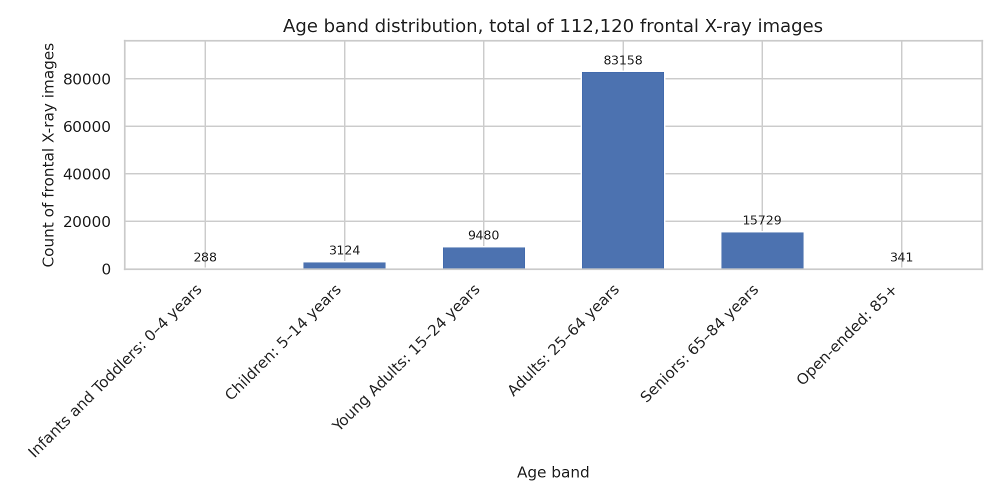

**Analysis:** This distribution chart outlines the demographic or clinical breakdown of the dataset, which is crucial for identifying potential biases or representation gaps in the evaluation cohort. This ID comparison aggregates performance across multiple models on the native test distribution, establishing a baseline for expected clinical efficacy within the training domain. Overall, this graph is a vital component of the holistic evaluation framework, contributing to a multi-faceted understanding of model reliability and clinical readiness.

##### Figure 2: Label Prevalence

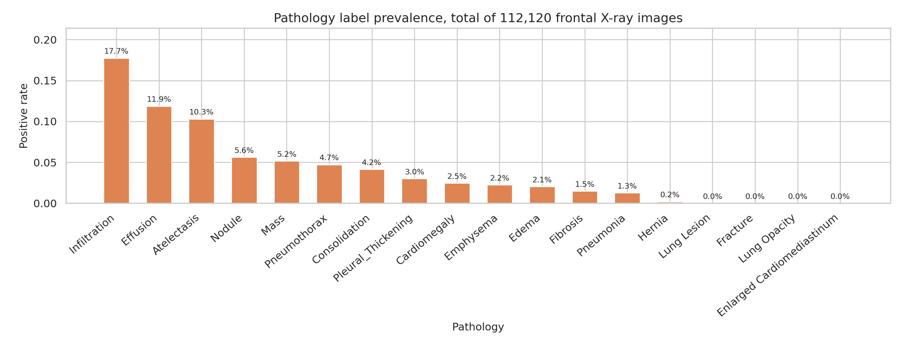

**Analysis:** This plot displays the Area Under the Precision-Recall Curve (AUPRC), which is particularly informative for imbalanced datasets as it focuses on the positive predictive value. This ID comparison aggregates performance across multiple models on the native test distribution, establishing a baseline for expected clinical efficacy within the training domain. Overall, this graph is a vital component of the holistic evaluation framework, contributing to a multi-faceted understanding of model reliability and clinical readiness.

##### Figure 3: Macro Auroc Ignore Uncertain

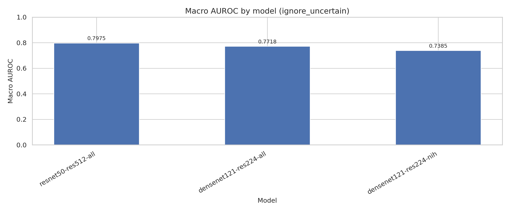

**Analysis:** This graph illustrates the Area Under the Receiver Operating Characteristic curve (AUROC), highlighting the model's ability to discriminate between positive and negative classes. In this evaluation setting, uncertain labels (typically marked as -1 in CheXpert-style datasets) are excluded from the metric computation, providing a clearer view of performance on definitive cases. This ID comparison aggregates performance across multiple models on the native test distribution, establishing a baseline for expected clinical efficacy within the training domain. Overall, this graph is a vital component of the holistic evaluation framework, contributing to a multi-faceted understanding of model reliability and clinical readiness.

##### Figure 4: Macro Auroc U0

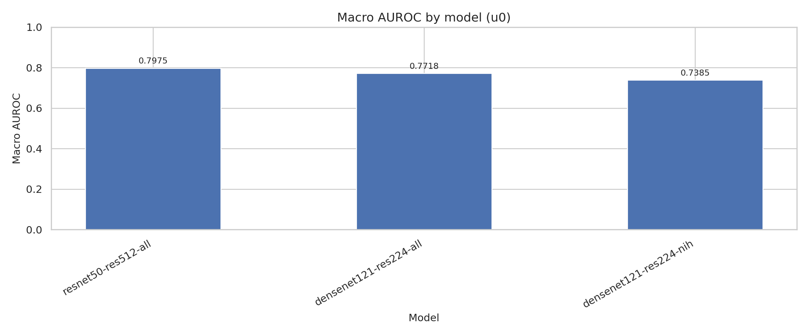

**Analysis:** This graph illustrates the Area Under the Receiver Operating Characteristic curve (AUROC), highlighting the model's ability to discriminate between positive and negative classes. Here, uncertain labels are mapped to negative (0), which represents a more conservative clinical assumption and tests the model's robustness against ambiguous ground truths. This ID comparison aggregates performance across multiple models on the native test distribution, establishing a baseline for expected clinical efficacy within the training domain. Overall, this graph is a vital component of the holistic evaluation framework, contributing to a multi-faceted understanding of model reliability and clinical readiness.

##### Figure 5: Manufacturer Distribution

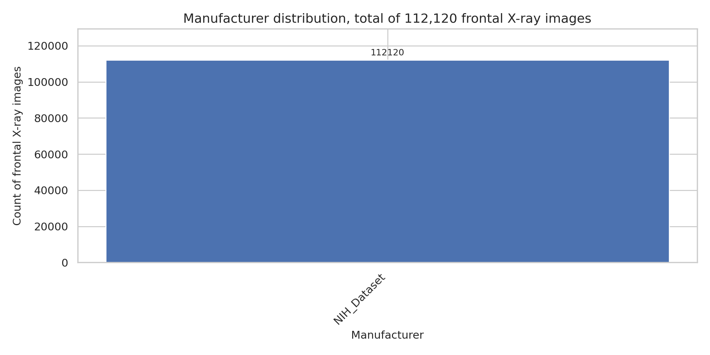

**Analysis:** This distribution chart outlines the demographic or clinical breakdown of the dataset, which is crucial for identifying potential biases or representation gaps in the evaluation cohort. This ID comparison aggregates performance across multiple models on the native test distribution, establishing a baseline for expected clinical efficacy within the training domain. Overall, this graph is a vital component of the holistic evaluation framework, contributing to a multi-faceted understanding of model reliability and clinical readiness.

##### Figure 6: Sex Distribution

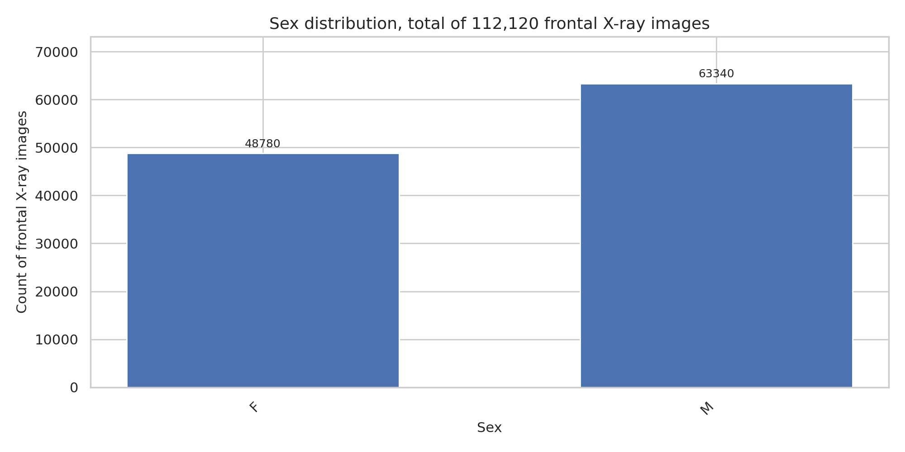

**Analysis:** This distribution chart outlines the demographic or clinical breakdown of the dataset, which is crucial for identifying potential biases or representation gaps in the evaluation cohort. This ID comparison aggregates performance across multiple models on the native test distribution, establishing a baseline for expected clinical efficacy within the training domain. Overall, this graph is a vital component of the holistic evaluation framework, contributing to a multi-faceted understanding of model reliability and clinical readiness.

##### Figure 7: View Distribution

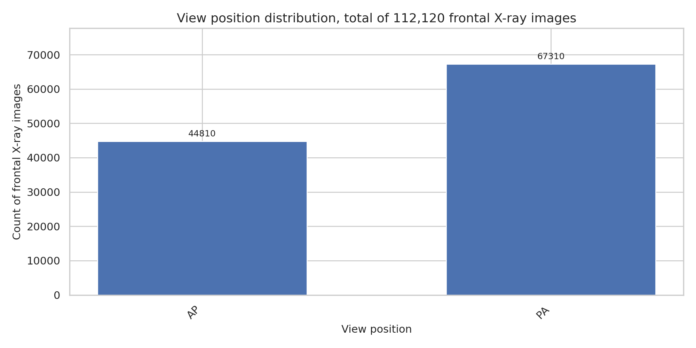

**Analysis:** This distribution chart outlines the demographic or clinical breakdown of the dataset, which is crucial for identifying potential biases or representation gaps in the evaluation cohort. This ID comparison aggregates performance across multiple models on the native test distribution, establishing a baseline for expected clinical efficacy within the training domain. Overall, this graph is a vital component of the holistic evaluation framework, contributing to a multi-faceted understanding of model reliability and clinical readiness.

#### OOD Results Comparison

##### Figure 8: Age Band Distribution

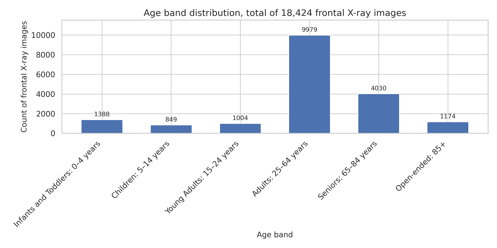

**Analysis:** This distribution chart outlines the demographic or clinical breakdown of the dataset, which is crucial for identifying potential biases or representation gaps in the evaluation cohort. This OOD comparison is critical for assessing real-world robustness, showing how different models degrade when exposed to new hospital systems or demographic shifts. Overall, this graph is a vital component of the holistic evaluation framework, contributing to a multi-faceted understanding of model reliability and clinical readiness.

##### Figure 9: Bootstrap Ci Macro Auprc Ap Ignore Uncertain

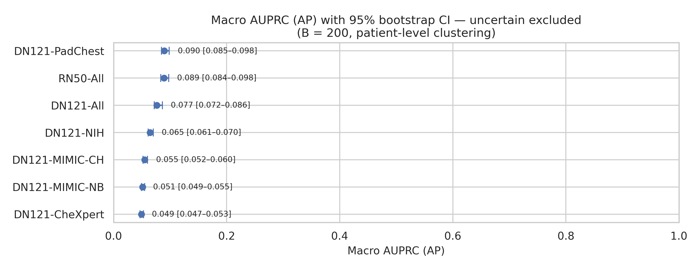

**Analysis:** This plot displays the Area Under the Precision-Recall Curve (AUPRC), which is particularly informative for imbalanced datasets as it focuses on the positive predictive value. In this evaluation setting, uncertain labels (typically marked as -1 in CheXpert-style datasets) are excluded from the metric computation, providing a clearer view of performance on definitive cases. This OOD comparison is critical for assessing real-world robustness, showing how different models degrade when exposed to new hospital systems or demographic shifts. The inclusion of bootstrap confidence intervals provides statistical rigor, confirming that the observed performance differences are significant and not merely artifacts of sample variance.

##### Figure 10: Bootstrap Ci Macro Auprc Ap U0

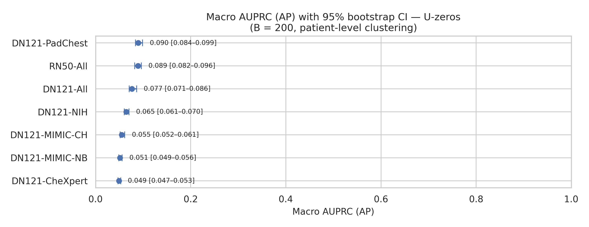

**Analysis:** This plot displays the Area Under the Precision-Recall Curve (AUPRC), which is particularly informative for imbalanced datasets as it focuses on the positive predictive value. Here, uncertain labels are mapped to negative (0), which represents a more conservative clinical assumption and tests the model's robustness against ambiguous ground truths. This OOD comparison is critical for assessing real-world robustness, showing how different models degrade when exposed to new hospital systems or demographic shifts. The inclusion of bootstrap confidence intervals provides statistical rigor, confirming that the observed performance differences are significant and not merely artifacts of sample variance.

##### Figure 11: Bootstrap Ci Macro Auroc Ignore Uncertain

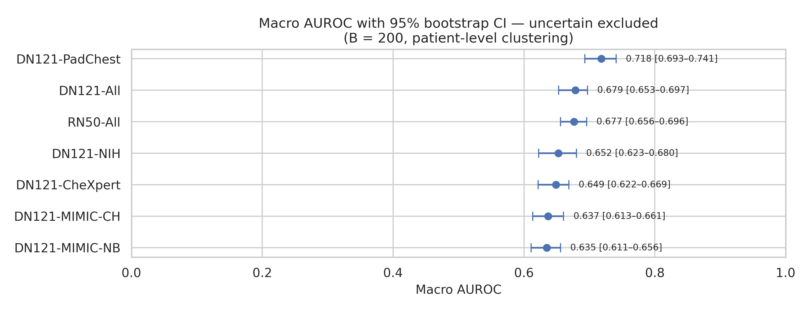

**Analysis:** This graph illustrates the Area Under the Receiver Operating Characteristic curve (AUROC), highlighting the model's ability to discriminate between positive and negative classes. In this evaluation setting, uncertain labels (typically marked as -1 in CheXpert-style datasets) are excluded from the metric computation, providing a clearer view of performance on definitive cases. This OOD comparison is critical for assessing real-world robustness, showing how different models degrade when exposed to new hospital systems or demographic shifts. The inclusion of bootstrap confidence intervals provides statistical rigor, confirming that the observed performance differences are significant and not merely artifacts of sample variance.

##### Figure 12: Bootstrap Ci Macro Auroc U0

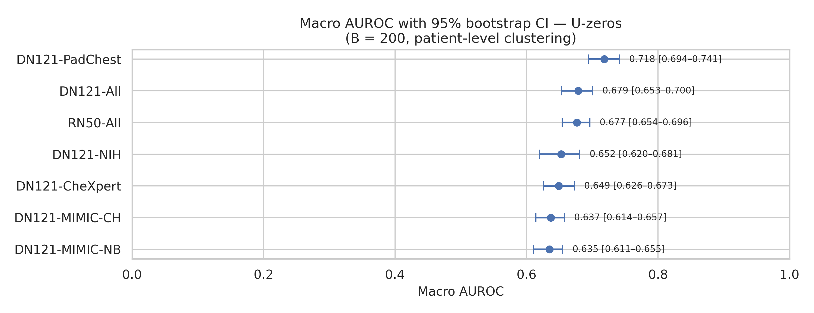

**Analysis:** This graph illustrates the Area Under the Receiver Operating Characteristic curve (AUROC), highlighting the model's ability to discriminate between positive and negative classes. Here, uncertain labels are mapped to negative (0), which represents a more conservative clinical assumption and tests the model's robustness against ambiguous ground truths. This OOD comparison is critical for assessing real-world robustness, showing how different models degrade when exposed to new hospital systems or demographic shifts. The inclusion of bootstrap confidence intervals provides statistical rigor, confirming that the observed performance differences are significant and not merely artifacts of sample variance.

##### Figure 13: Fair Macro Auprc Ap Common Ignore Uncertain

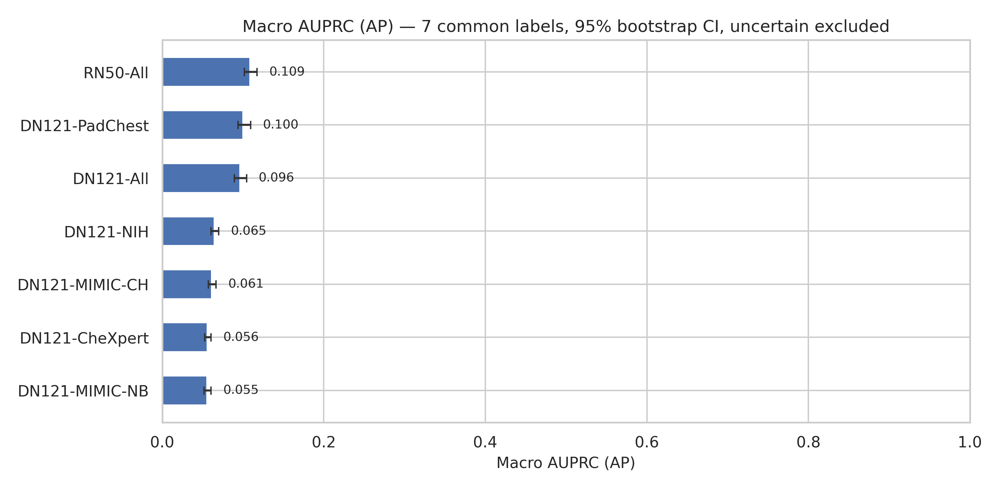

**Analysis:** This plot displays the Area Under the Precision-Recall Curve (AUPRC), which is particularly informative for imbalanced datasets as it focuses on the positive predictive value. In this evaluation setting, uncertain labels (typically marked as -1 in CheXpert-style datasets) are excluded from the metric computation, providing a clearer view of performance on definitive cases. This OOD comparison is critical for assessing real-world robustness, showing how different models degrade when exposed to new hospital systems or demographic shifts. The subgroup breakdown is essential for algorithmic fairness, ensuring that the model does not disproportionately underperform on specific demographic or clinical cohorts.

##### Figure 14: Fair Macro Auprc Ap Common U0

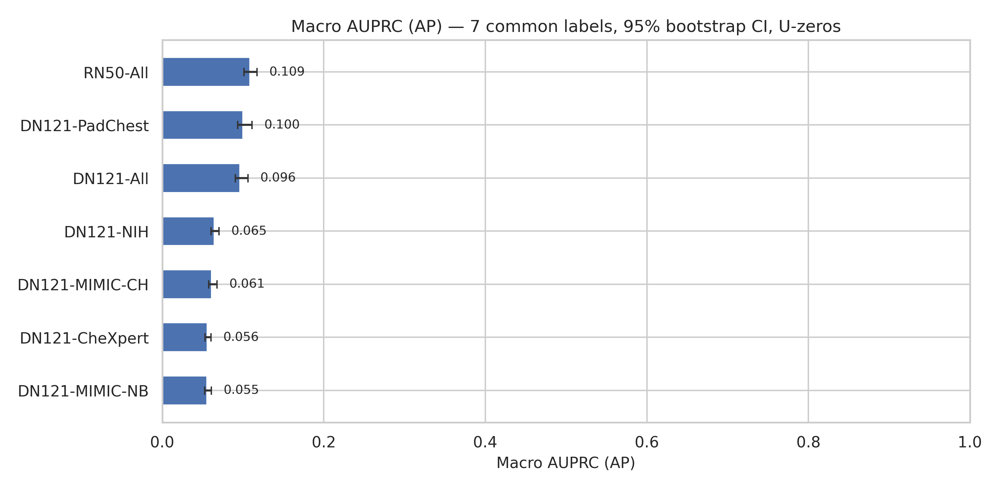

**Analysis:** This plot displays the Area Under the Precision-Recall Curve (AUPRC), which is particularly informative for imbalanced datasets as it focuses on the positive predictive value. Here, uncertain labels are mapped to negative (0), which represents a more conservative clinical assumption and tests the model's robustness against ambiguous ground truths. This OOD comparison is critical for assessing real-world robustness, showing how different models degrade when exposed to new hospital systems or demographic shifts. The subgroup breakdown is essential for algorithmic fairness, ensuring that the model does not disproportionately underperform on specific demographic or clinical cohorts.

##### Figure 15: Fair Macro Auroc Common Ignore Uncertain

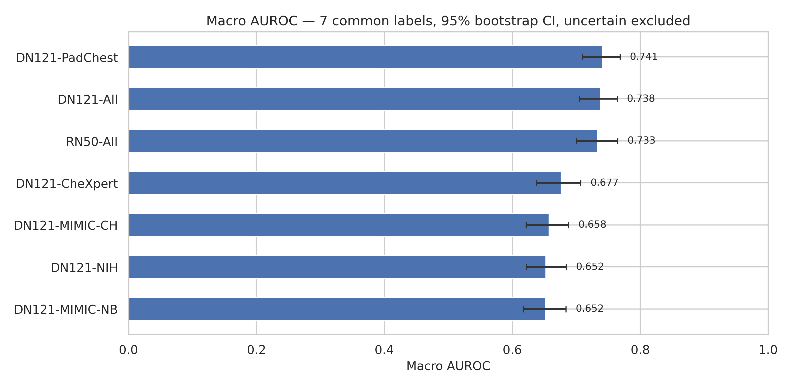

**Analysis:** This graph illustrates the Area Under the Receiver Operating Characteristic curve (AUROC), highlighting the model's ability to discriminate between positive and negative classes. In this evaluation setting, uncertain labels (typically marked as -1 in CheXpert-style datasets) are excluded from the metric computation, providing a clearer view of performance on definitive cases. This OOD comparison is critical for assessing real-world robustness, showing how different models degrade when exposed to new hospital systems or demographic shifts. The subgroup breakdown is essential for algorithmic fairness, ensuring that the model does not disproportionately underperform on specific demographic or clinical cohorts.

##### Figure 16: Fair Macro Auroc Common U0

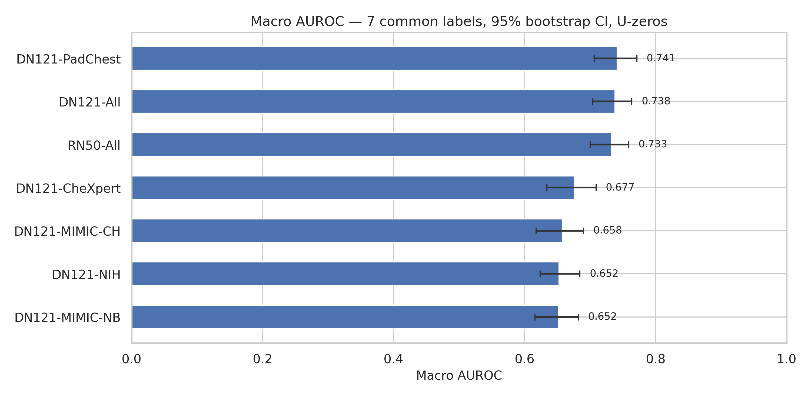

**Analysis:** This graph illustrates the Area Under the Receiver Operating Characteristic curve (AUROC), highlighting the model's ability to discriminate between positive and negative classes. Here, uncertain labels are mapped to negative (0), which represents a more conservative clinical assumption and tests the model's robustness against ambiguous ground truths. This OOD comparison is critical for assessing real-world robustness, showing how different models degrade when exposed to new hospital systems or demographic shifts. The subgroup breakdown is essential for algorithmic fairness, ensuring that the model does not disproportionately underperform on specific demographic or clinical cohorts.

##### Figure 17: Heatmap Auprc Ap Common Ignore Uncertain

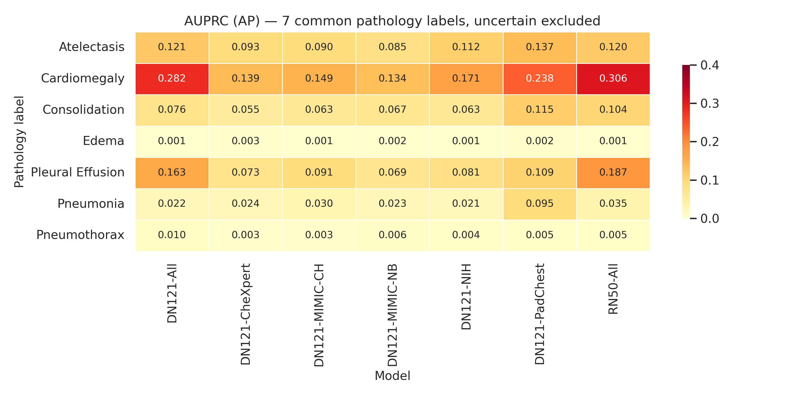

**Analysis:** This plot displays the Area Under the Precision-Recall Curve (AUPRC), which is particularly informative for imbalanced datasets as it focuses on the positive predictive value. In this evaluation setting, uncertain labels (typically marked as -1 in CheXpert-style datasets) are excluded from the metric computation, providing a clearer view of performance on definitive cases. This OOD comparison is critical for assessing real-world robustness, showing how different models degrade when exposed to new hospital systems or demographic shifts. Analyzing per-label performance reveals pathology-specific variances, indicating that some conditions (e.g., distinct morphological abnormalities) are inherently more challenging to detect than others.

##### Figure 18: Heatmap Auprc Ap Common U0

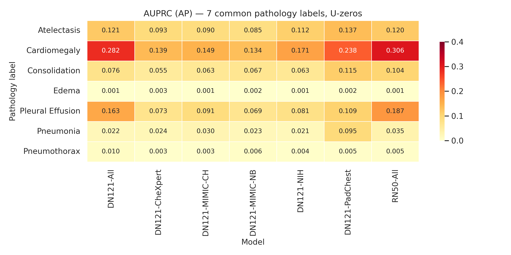

**Analysis:** This plot displays the Area Under the Precision-Recall Curve (AUPRC), which is particularly informative for imbalanced datasets as it focuses on the positive predictive value. Here, uncertain labels are mapped to negative (0), which represents a more conservative clinical assumption and tests the model's robustness against ambiguous ground truths. This OOD comparison is critical for assessing real-world robustness, showing how different models degrade when exposed to new hospital systems or demographic shifts. Analyzing per-label performance reveals pathology-specific variances, indicating that some conditions (e.g., distinct morphological abnormalities) are inherently more challenging to detect than others.

##### Figure 19: Heatmap Auroc Common Ignore Uncertain

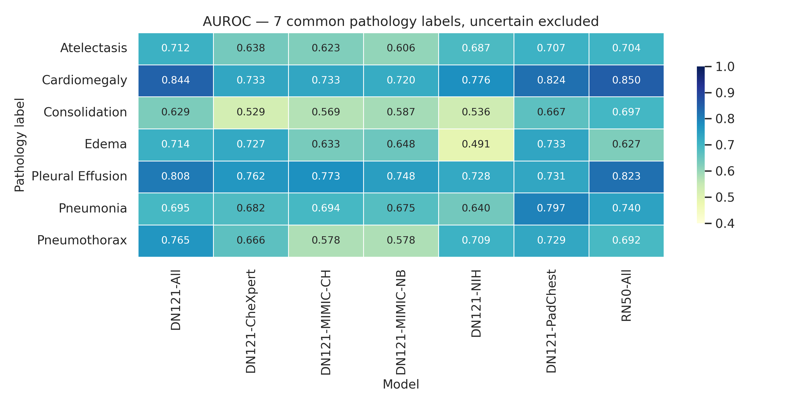

**Analysis:** This graph illustrates the Area Under the Receiver Operating Characteristic curve (AUROC), highlighting the model's ability to discriminate between positive and negative classes. In this evaluation setting, uncertain labels (typically marked as -1 in CheXpert-style datasets) are excluded from the metric computation, providing a clearer view of performance on definitive cases. This OOD comparison is critical for assessing real-world robustness, showing how different models degrade when exposed to new hospital systems or demographic shifts. Analyzing per-label performance reveals pathology-specific variances, indicating that some conditions (e.g., distinct morphological abnormalities) are inherently more challenging to detect than others.

##### Figure 20: Heatmap Auroc Common U0

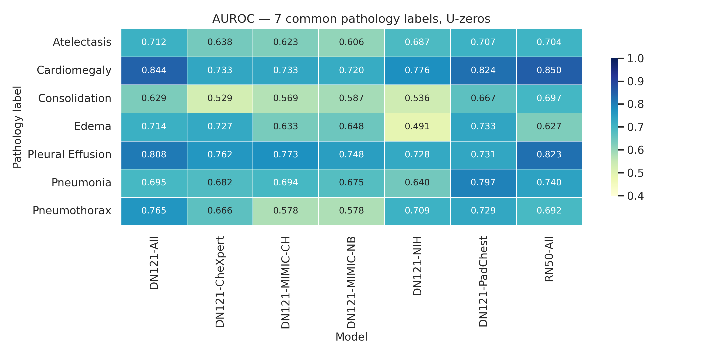

**Analysis:** This graph illustrates the Area Under the Receiver Operating Characteristic curve (AUROC), highlighting the model's ability to discriminate between positive and negative classes. Here, uncertain labels are mapped to negative (0), which represents a more conservative clinical assumption and tests the model's robustness against ambiguous ground truths. This OOD comparison is critical for assessing real-world robustness, showing how different models degrade when exposed to new hospital systems or demographic shifts. Analyzing per-label performance reveals pathology-specific variances, indicating that some conditions (e.g., distinct morphological abnormalities) are inherently more challenging to detect than others.

##### Figure 21: Heatmap Brier Common Ignore Uncertain

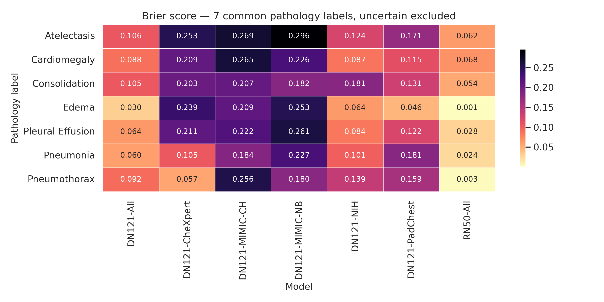

**Analysis:** This visualization shows the Brier score, providing a measure of the accuracy of probabilistic predictions (calibration and sharpness). In this evaluation setting, uncertain labels (typically marked as -1 in CheXpert-style datasets) are excluded from the metric computation, providing a clearer view of performance on definitive cases. This OOD comparison is critical for assessing real-world robustness, showing how different models degrade when exposed to new hospital systems or demographic shifts. Analyzing per-label performance reveals pathology-specific variances, indicating that some conditions (e.g., distinct morphological abnormalities) are inherently more challenging to detect than others.

##### Figure 22: Heatmap Brier Common U0

**Analysis:** This visualization shows the Brier score, providing a measure of the accuracy of probabilistic predictions (calibration and sharpness). Here, uncertain labels are mapped to negative (0), which represents a more conservative clinical assumption and tests the model's robustness against ambiguous ground truths. This OOD comparison is critical for assessing real-world robustness, showing how different models degrade when exposed to new hospital systems or demographic shifts. Analyzing per-label performance reveals pathology-specific variances, indicating that some conditions (e.g., distinct morphological abnormalities) are inherently more challenging to detect than others.

##### Figure 23: Heatmap Ci Width Auprc Ap Ignore Uncertain

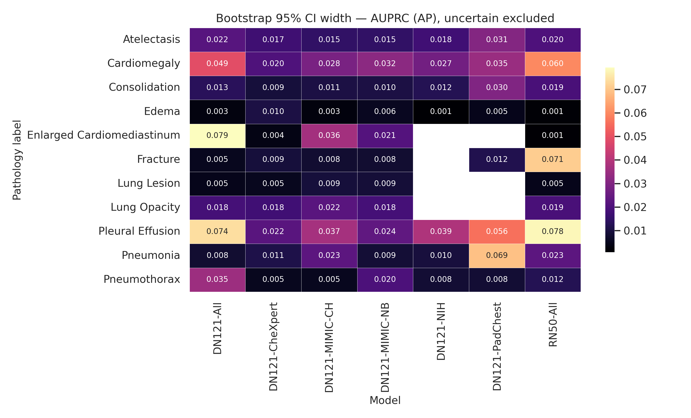

**Analysis:** This plot displays the Area Under the Precision-Recall Curve (AUPRC), which is particularly informative for imbalanced datasets as it focuses on the positive predictive value. In this evaluation setting, uncertain labels (typically marked as -1 in CheXpert-style datasets) are excluded from the metric computation, providing a clearer view of performance on definitive cases. This OOD comparison is critical for assessing real-world robustness, showing how different models degrade when exposed to new hospital systems or demographic shifts. The inclusion of bootstrap confidence intervals provides statistical rigor, confirming that the observed performance differences are significant and not merely artifacts of sample variance.

##### Figure 24: Heatmap Ci Width Auprc Ap U0

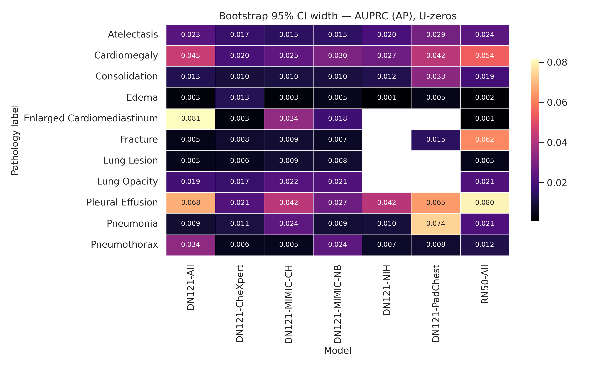

**Analysis:** This plot displays the Area Under the Precision-Recall Curve (AUPRC), which is particularly informative for imbalanced datasets as it focuses on the positive predictive value. Here, uncertain labels are mapped to negative (0), which represents a more conservative clinical assumption and tests the model's robustness against ambiguous ground truths. This OOD comparison is critical for assessing real-world robustness, showing how different models degrade when exposed to new hospital systems or demographic shifts. The inclusion of bootstrap confidence intervals provides statistical rigor, confirming that the observed performance differences are significant and not merely artifacts of sample variance.

##### Figure 25: Heatmap Ci Width Auroc Ignore Uncertain

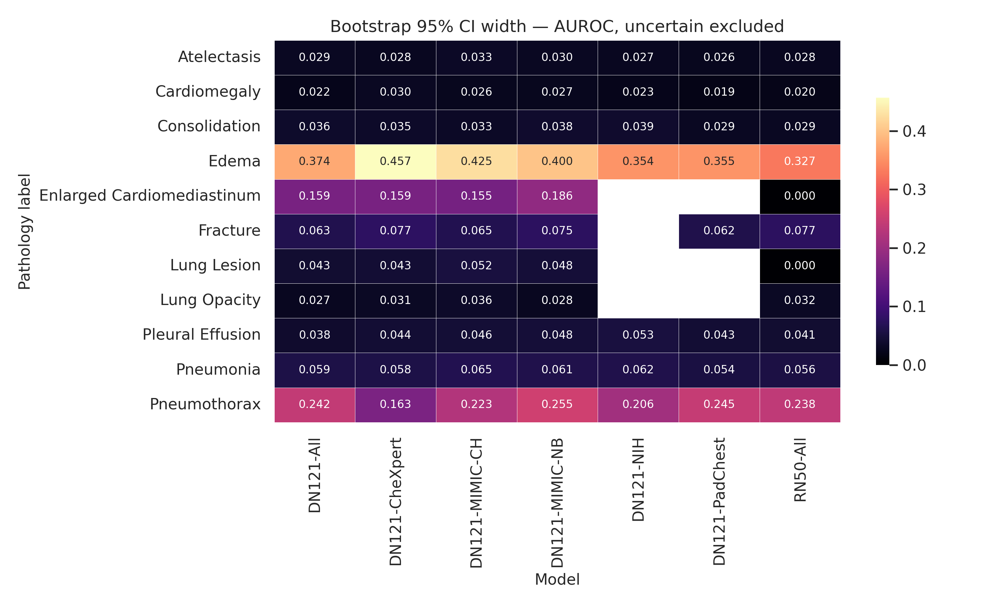

**Analysis:** This graph illustrates the Area Under the Receiver Operating Characteristic curve (AUROC), highlighting the model's ability to discriminate between positive and negative classes. In this evaluation setting, uncertain labels (typically marked as -1 in CheXpert-style datasets) are excluded from the metric computation, providing a clearer view of performance on definitive cases. This OOD comparison is critical for assessing real-world robustness, showing how different models degrade when exposed to new hospital systems or demographic shifts. The inclusion of bootstrap confidence intervals provides statistical rigor, confirming that the observed performance differences are significant and not merely artifacts of sample variance.

##### Figure 26: Heatmap Ci Width Auroc U0

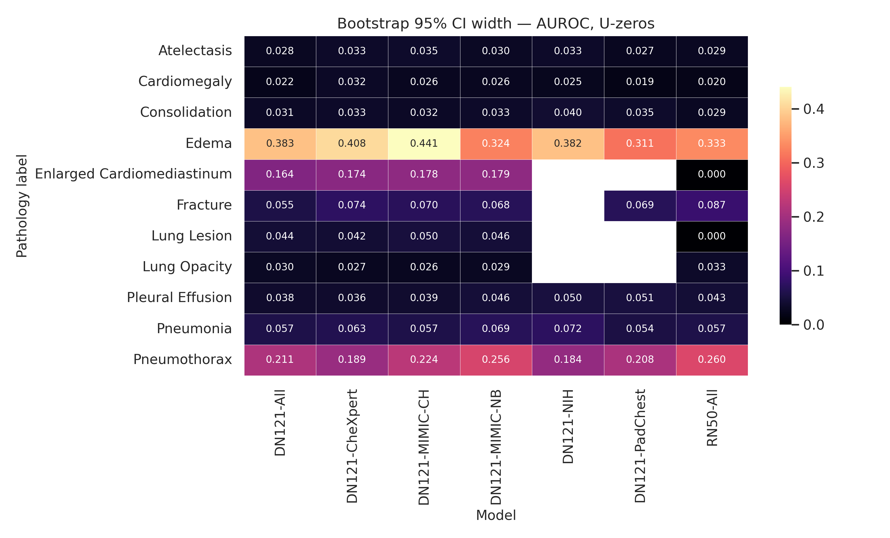

**Analysis:** This graph illustrates the Area Under the Receiver Operating Characteristic curve (AUROC), highlighting the model's ability to discriminate between positive and negative classes. Here, uncertain labels are mapped to negative (0), which represents a more conservative clinical assumption and tests the model's robustness against ambiguous ground truths. This OOD comparison is critical for assessing real-world robustness, showing how different models degrade when exposed to new hospital systems or demographic shifts. The inclusion of bootstrap confidence intervals provides statistical rigor, confirming that the observed performance differences are significant and not merely artifacts of sample variance.

##### Figure 27: Heatmap Ece 10Bin Common Ignore Uncertain

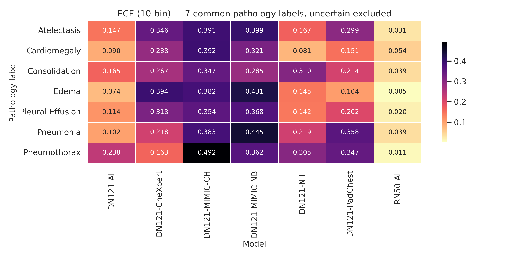

**Analysis:** This graph presents the Expected Calibration Error (ECE), quantifying how well the predicted probabilities align with the actual observed frequencies. In this evaluation setting, uncertain labels (typically marked as -1 in CheXpert-style datasets) are excluded from the metric computation, providing a clearer view of performance on definitive cases. This OOD comparison is critical for assessing real-world robustness, showing how different models degrade when exposed to new hospital systems or demographic shifts. Analyzing per-label performance reveals pathology-specific variances, indicating that some conditions (e.g., distinct morphological abnormalities) are inherently more challenging to detect than others.

##### Figure 28: Heatmap Ece 10Bin Common U0

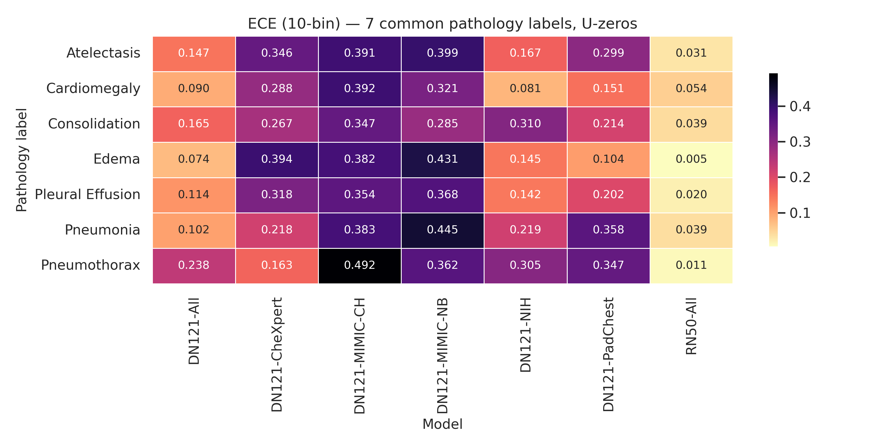

**Analysis:** This graph presents the Expected Calibration Error (ECE), quantifying how well the predicted probabilities align with the actual observed frequencies. Here, uncertain labels are mapped to negative (0), which represents a more conservative clinical assumption and tests the model's robustness against ambiguous ground truths. This OOD comparison is critical for assessing real-world robustness, showing how different models degrade when exposed to new hospital systems or demographic shifts. Analyzing per-label performance reveals pathology-specific variances, indicating that some conditions (e.g., distinct morphological abnormalities) are inherently more challenging to detect than others.

##### Figure 29: Label Prevalence

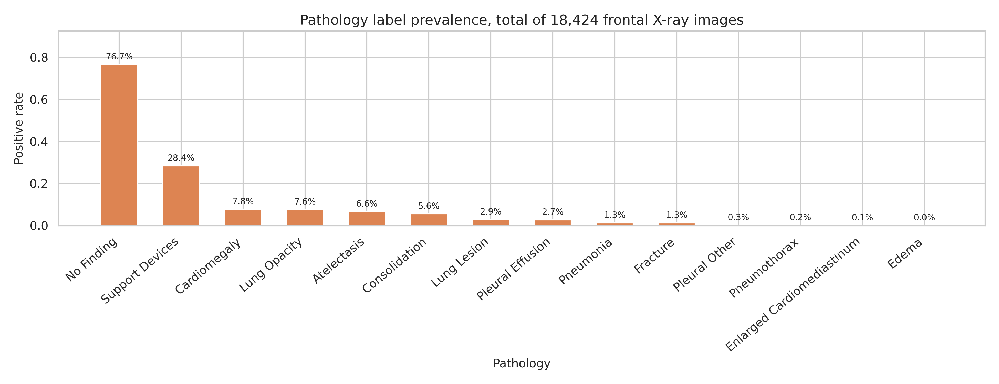

**Analysis:** This plot displays the Area Under the Precision-Recall Curve (AUPRC), which is particularly informative for imbalanced datasets as it focuses on the positive predictive value. This OOD comparison is critical for assessing real-world robustness, showing how different models degrade when exposed to new hospital systems or demographic shifts. Overall, this graph is a vital component of the holistic evaluation framework, contributing to a multi-faceted understanding of model reliability and clinical readiness.

##### Figure 30: Manufacturer Distribution

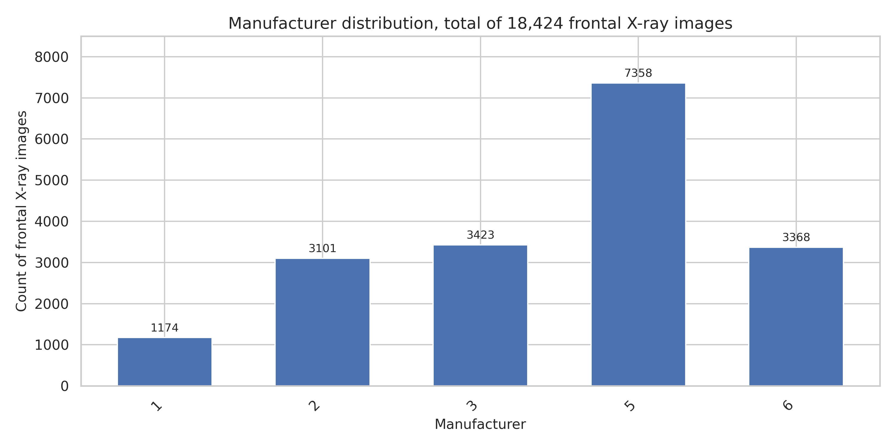

**Analysis:** This distribution chart outlines the demographic or clinical breakdown of the dataset, which is crucial for identifying potential biases or representation gaps in the evaluation cohort. This OOD comparison is critical for assessing real-world robustness, showing how different models degrade when exposed to new hospital systems or demographic shifts. Overall, this graph is a vital component of the holistic evaluation framework, contributing to a multi-faceted understanding of model reliability and clinical readiness.

##### Figure 31: Overlay Pr Common Ignore Uncertain

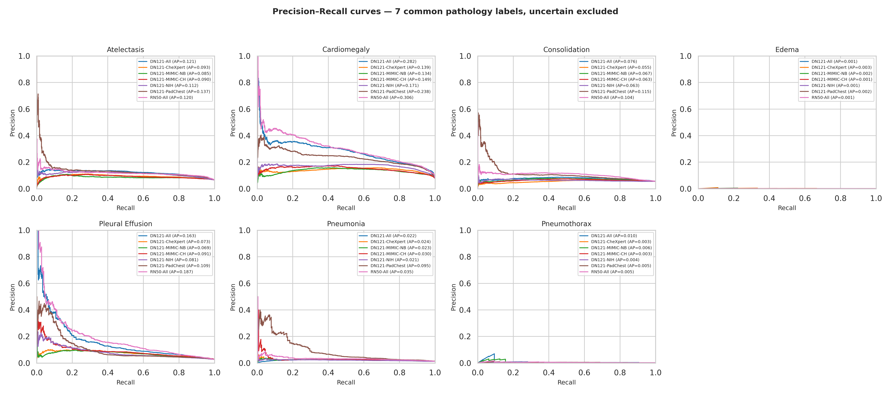

**Analysis:** This plot displays the Area Under the Precision-Recall Curve (AUPRC), which is particularly informative for imbalanced datasets as it focuses on the positive predictive value. In this evaluation setting, uncertain labels (typically marked as -1 in CheXpert-style datasets) are excluded from the metric computation, providing a clearer view of performance on definitive cases. This OOD comparison is critical for assessing real-world robustness, showing how different models degrade when exposed to new hospital systems or demographic shifts. Analyzing per-label performance reveals pathology-specific variances, indicating that some conditions (e.g., distinct morphological abnormalities) are inherently more challenging to detect than others.

##### Figure 32: Overlay Pr Common U0

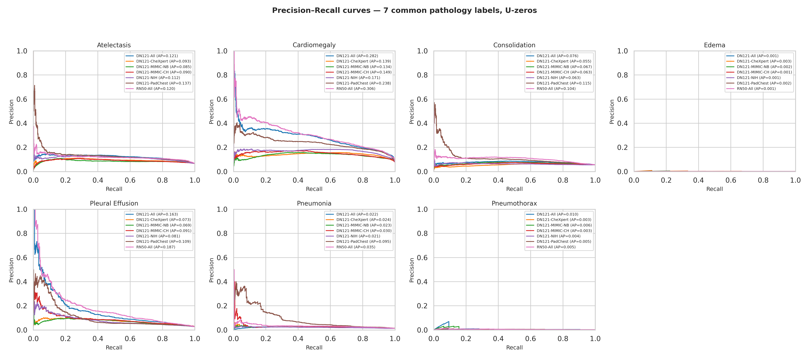

**Analysis:** This plot displays the Area Under the Precision-Recall Curve (AUPRC), which is particularly informative for imbalanced datasets as it focuses on the positive predictive value. Here, uncertain labels are mapped to negative (0), which represents a more conservative clinical assumption and tests the model's robustness against ambiguous ground truths. This OOD comparison is critical for assessing real-world robustness, showing how different models degrade when exposed to new hospital systems or demographic shifts. Analyzing per-label performance reveals pathology-specific variances, indicating that some conditions (e.g., distinct morphological abnormalities) are inherently more challenging to detect than others.

##### Figure 33: Overlay Roc Common Ignore Uncertain

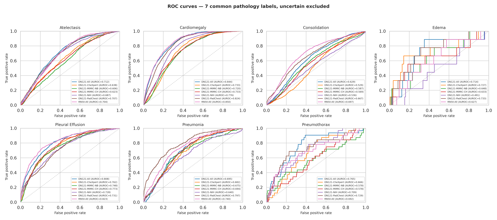

**Analysis:** This graph illustrates the Area Under the Receiver Operating Characteristic curve (AUROC), highlighting the model's ability to discriminate between positive and negative classes. In this evaluation setting, uncertain labels (typically marked as -1 in CheXpert-style datasets) are excluded from the metric computation, providing a clearer view of performance on definitive cases. This OOD comparison is critical for assessing real-world robustness, showing how different models degrade when exposed to new hospital systems or demographic shifts. Analyzing per-label performance reveals pathology-specific variances, indicating that some conditions (e.g., distinct morphological abnormalities) are inherently more challenging to detect than others.

##### Figure 34: Overlay Roc Common U0

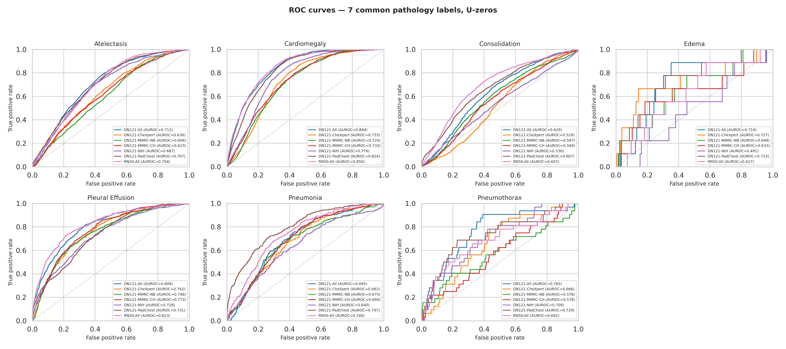

**Analysis:** This graph illustrates the Area Under the Receiver Operating Characteristic curve (AUROC), highlighting the model's ability to discriminate between positive and negative classes. Here, uncertain labels are mapped to negative (0), which represents a more conservative clinical assumption and tests the model's robustness against ambiguous ground truths. This OOD comparison is critical for assessing real-world robustness, showing how different models degrade when exposed to new hospital systems or demographic shifts. Analyzing per-label performance reveals pathology-specific variances, indicating that some conditions (e.g., distinct morphological abnormalities) are inherently more challenging to detect than others.

##### Figure 35: Per Label Ap Common Ignore Uncertain

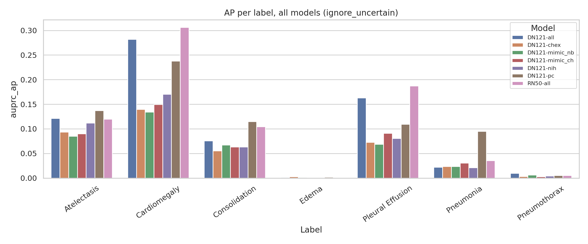

**Analysis:** This visualization provides key performance indicators for the evaluated models and subgroups. In this evaluation setting, uncertain labels (typically marked as -1 in CheXpert-style datasets) are excluded from the metric computation, providing a clearer view of performance on definitive cases. This OOD comparison is critical for assessing real-world robustness, showing how different models degrade when exposed to new hospital systems or demographic shifts. Analyzing per-label performance reveals pathology-specific variances, indicating that some conditions (e.g., distinct morphological abnormalities) are inherently more challenging to detect than others.

##### Figure 36: Per Label Ap Common U0

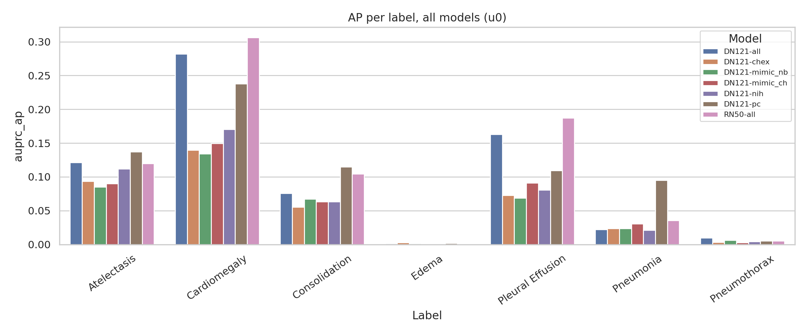

**Analysis:** This visualization provides key performance indicators for the evaluated models and subgroups. Here, uncertain labels are mapped to negative (0), which represents a more conservative clinical assumption and tests the model's robustness against ambiguous ground truths. This OOD comparison is critical for assessing real-world robustness, showing how different models degrade when exposed to new hospital systems or demographic shifts. Analyzing per-label performance reveals pathology-specific variances, indicating that some conditions (e.g., distinct morphological abnormalities) are inherently more challenging to detect than others.

##### Figure 37: Per Label Auprc Ap Common Ignore Uncertain

**Analysis:** This plot displays the Area Under the Precision-Recall Curve (AUPRC), which is particularly informative for imbalanced datasets as it focuses on the positive predictive value. In this evaluation setting, uncertain labels (typically marked as -1 in CheXpert-style datasets) are excluded from the metric computation, providing a clearer view of performance on definitive cases. This OOD comparison is critical for assessing real-world robustness, showing how different models degrade when exposed to new hospital systems or demographic shifts. Analyzing per-label performance reveals pathology-specific variances, indicating that some conditions (e.g., distinct morphological abnormalities) are inherently more challenging to detect than others.

##### Figure 38: Per Label Auprc Ap Common U0

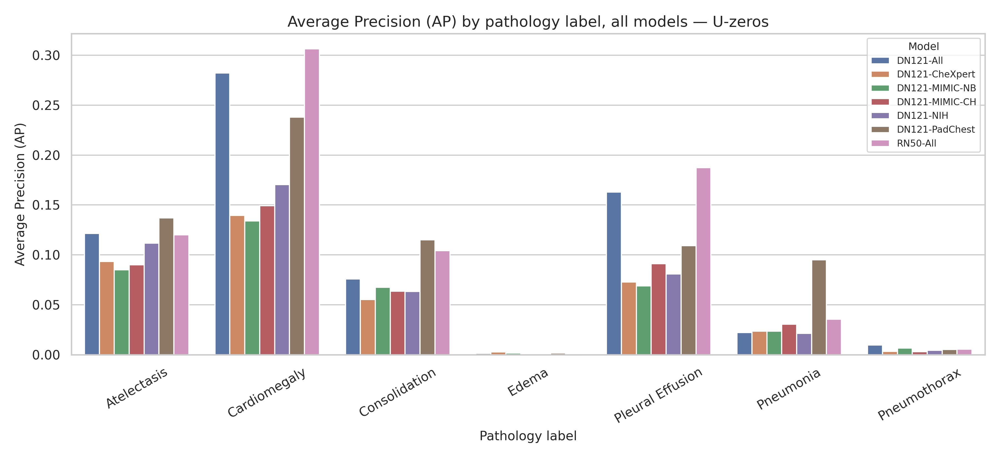

**Analysis:** This plot displays the Area Under the Precision-Recall Curve (AUPRC), which is particularly informative for imbalanced datasets as it focuses on the positive predictive value. Here, uncertain labels are mapped to negative (0), which represents a more conservative clinical assumption and tests the model's robustness against ambiguous ground truths. This OOD comparison is critical for assessing real-world robustness, showing how different models degrade when exposed to new hospital systems or demographic shifts. Analyzing per-label performance reveals pathology-specific variances, indicating that some conditions (e.g., distinct morphological abnormalities) are inherently more challenging to detect than others.

##### Figure 39: Per Label Auroc Common Ignore Uncertain

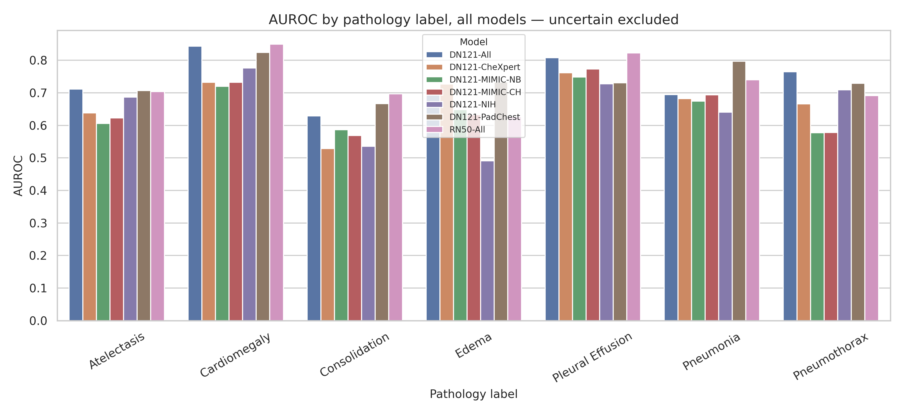

**Analysis:** This graph illustrates the Area Under the Receiver Operating Characteristic curve (AUROC), highlighting the model's ability to discriminate between positive and negative classes. In this evaluation setting, uncertain labels (typically marked as -1 in CheXpert-style datasets) are excluded from the metric computation, providing a clearer view of performance on definitive cases. This OOD comparison is critical for assessing real-world robustness, showing how different models degrade when exposed to new hospital systems or demographic shifts. Analyzing per-label performance reveals pathology-specific variances, indicating that some conditions (e.g., distinct morphological abnormalities) are inherently more challenging to detect than others.

##### Figure 40: Per Label Auroc Common U0

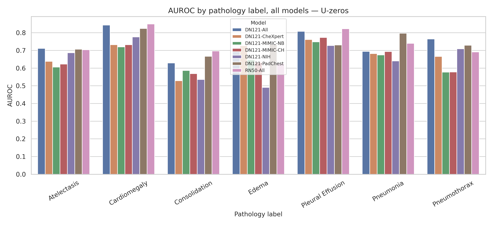

**Analysis:** This graph illustrates the Area Under the Receiver Operating Characteristic curve (AUROC), highlighting the model's ability to discriminate between positive and negative classes. Here, uncertain labels are mapped to negative (0), which represents a more conservative clinical assumption and tests the model's robustness against ambiguous ground truths. This OOD comparison is critical for assessing real-world robustness, showing how different models degrade when exposed to new hospital systems or demographic shifts. Analyzing per-label performance reveals pathology-specific variances, indicating that some conditions (e.g., distinct morphological abnormalities) are inherently more challenging to detect than others.

##### Figure 41: Sex Distribution

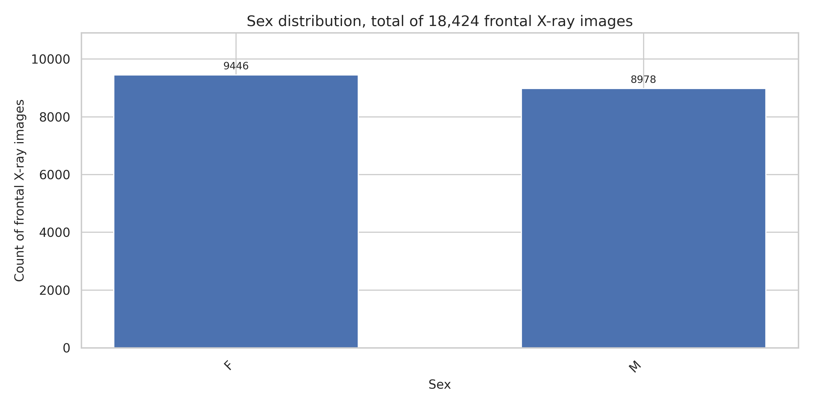

**Analysis:** This distribution chart outlines the demographic or clinical breakdown of the dataset, which is crucial for identifying potential biases or representation gaps in the evaluation cohort. This OOD comparison is critical for assessing real-world robustness, showing how different models degrade when exposed to new hospital systems or demographic shifts. Overall, this graph is a vital component of the holistic evaluation framework, contributing to a multi-faceted understanding of model reliability and clinical readiness.

##### Figure 42: Subgroup Macro Auprc Ap Age Band Ignore Uncertain

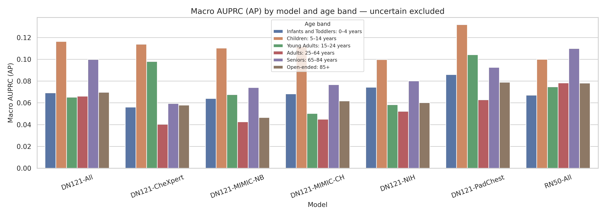

**Analysis:** This plot displays the Area Under the Precision-Recall Curve (AUPRC), which is particularly informative for imbalanced datasets as it focuses on the positive predictive value. In this evaluation setting, uncertain labels (typically marked as -1 in CheXpert-style datasets) are excluded from the metric computation, providing a clearer view of performance on definitive cases. This OOD comparison is critical for assessing real-world robustness, showing how different models degrade when exposed to new hospital systems or demographic shifts. The subgroup breakdown is essential for algorithmic fairness, ensuring that the model does not disproportionately underperform on specific demographic or clinical cohorts.

##### Figure 43: Subgroup Macro Auprc Ap Age Band U0

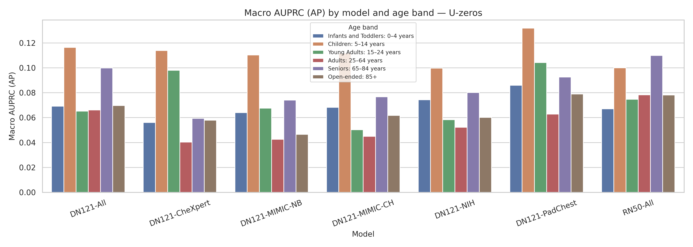

**Analysis:** This plot displays the Area Under the Precision-Recall Curve (AUPRC), which is particularly informative for imbalanced datasets as it focuses on the positive predictive value. Here, uncertain labels are mapped to negative (0), which represents a more conservative clinical assumption and tests the model's robustness against ambiguous ground truths. This OOD comparison is critical for assessing real-world robustness, showing how different models degrade when exposed to new hospital systems or demographic shifts. The subgroup breakdown is essential for algorithmic fairness, ensuring that the model does not disproportionately underperform on specific demographic or clinical cohorts.

##### Figure 44: Subgroup Macro Auprc Ap Manufacturer Ignore Uncertain

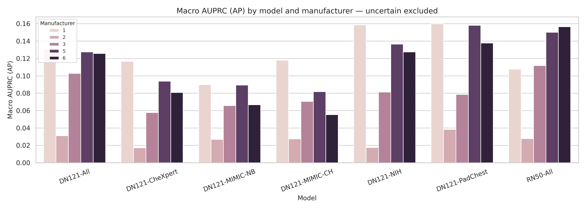

**Analysis:** This plot displays the Area Under the Precision-Recall Curve (AUPRC), which is particularly informative for imbalanced datasets as it focuses on the positive predictive value. In this evaluation setting, uncertain labels (typically marked as -1 in CheXpert-style datasets) are excluded from the metric computation, providing a clearer view of performance on definitive cases. This OOD comparison is critical for assessing real-world robustness, showing how different models degrade when exposed to new hospital systems or demographic shifts. The subgroup breakdown is essential for algorithmic fairness, ensuring that the model does not disproportionately underperform on specific demographic or clinical cohorts.

##### Figure 45: Subgroup Macro Auprc Ap Manufacturer U0

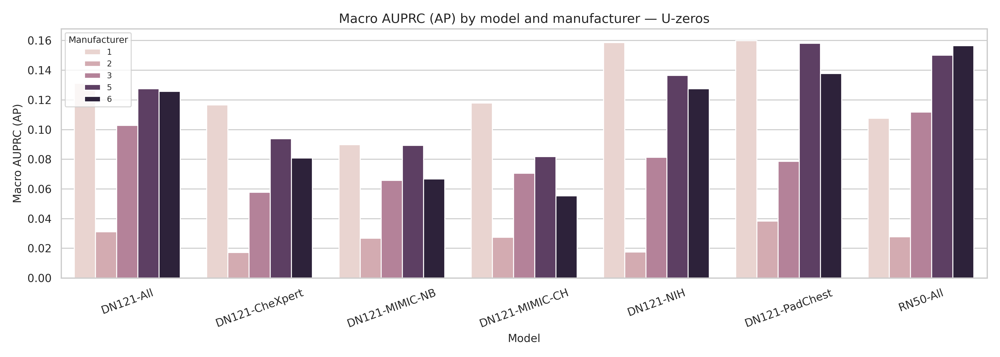

**Analysis:** This plot displays the Area Under the Precision-Recall Curve (AUPRC), which is particularly informative for imbalanced datasets as it focuses on the positive predictive value. Here, uncertain labels are mapped to negative (0), which represents a more conservative clinical assumption and tests the model's robustness against ambiguous ground truths. This OOD comparison is critical for assessing real-world robustness, showing how different models degrade when exposed to new hospital systems or demographic shifts. The subgroup breakdown is essential for algorithmic fairness, ensuring that the model does not disproportionately underperform on specific demographic or clinical cohorts.

##### Figure 46: Subgroup Macro Auprc Ap Sex Ignore Uncertain

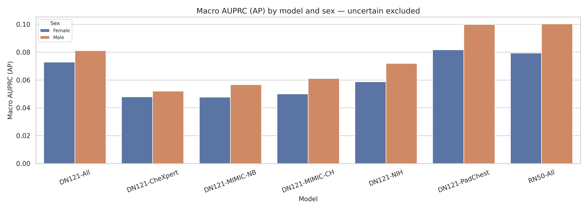

**Analysis:** This plot displays the Area Under the Precision-Recall Curve (AUPRC), which is particularly informative for imbalanced datasets as it focuses on the positive predictive value. In this evaluation setting, uncertain labels (typically marked as -1 in CheXpert-style datasets) are excluded from the metric computation, providing a clearer view of performance on definitive cases. This OOD comparison is critical for assessing real-world robustness, showing how different models degrade when exposed to new hospital systems or demographic shifts. The subgroup breakdown is essential for algorithmic fairness, ensuring that the model does not disproportionately underperform on specific demographic or clinical cohorts.

##### Figure 47: Subgroup Macro Auprc Ap Sex U0

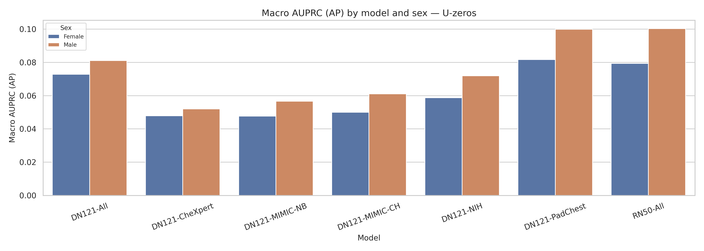

**Analysis:** This plot displays the Area Under the Precision-Recall Curve (AUPRC), which is particularly informative for imbalanced datasets as it focuses on the positive predictive value. Here, uncertain labels are mapped to negative (0), which represents a more conservative clinical assumption and tests the model's robustness against ambiguous ground truths. This OOD comparison is critical for assessing real-world robustness, showing how different models degrade when exposed to new hospital systems or demographic shifts. The subgroup breakdown is essential for algorithmic fairness, ensuring that the model does not disproportionately underperform on specific demographic or clinical cohorts.

##### Figure 48: Subgroup Macro Auprc Ap View Ignore Uncertain

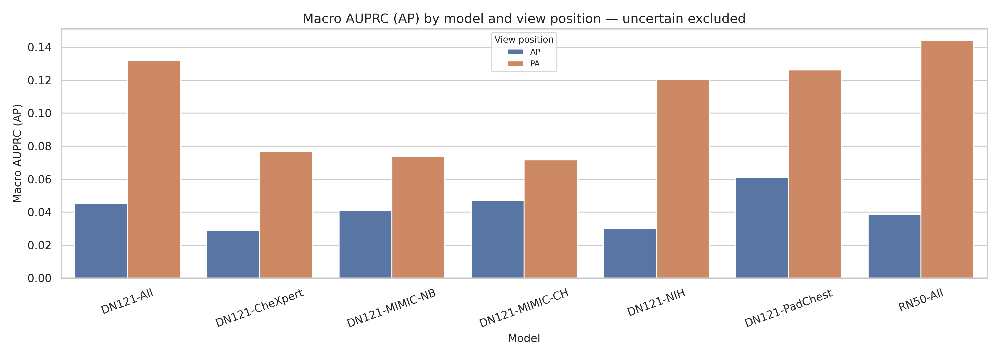

**Analysis:** This plot displays the Area Under the Precision-Recall Curve (AUPRC), which is particularly informative for imbalanced datasets as it focuses on the positive predictive value. In this evaluation setting, uncertain labels (typically marked as -1 in CheXpert-style datasets) are excluded from the metric computation, providing a clearer view of performance on definitive cases. This OOD comparison is critical for assessing real-world robustness, showing how different models degrade when exposed to new hospital systems or demographic shifts. The subgroup breakdown is essential for algorithmic fairness, ensuring that the model does not disproportionately underperform on specific demographic or clinical cohorts.

##### Figure 49: Subgroup Macro Auprc Ap View U0

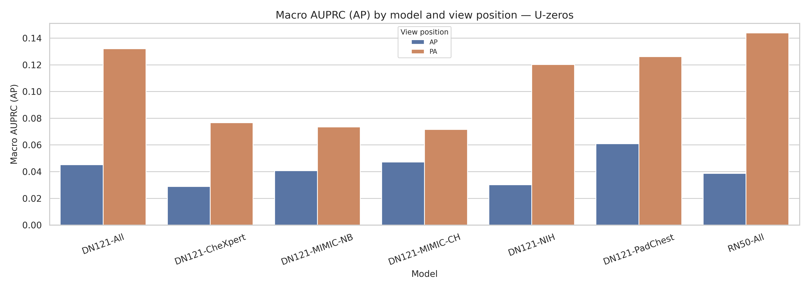

**Analysis:** This plot displays the Area Under the Precision-Recall Curve (AUPRC), which is particularly informative for imbalanced datasets as it focuses on the positive predictive value. Here, uncertain labels are mapped to negative (0), which represents a more conservative clinical assumption and tests the model's robustness against ambiguous ground truths. This OOD comparison is critical for assessing real-world robustness, showing how different models degrade when exposed to new hospital systems or demographic shifts. The subgroup breakdown is essential for algorithmic fairness, ensuring that the model does not disproportionately underperform on specific demographic or clinical cohorts.

##### Figure 50: Subgroup Macro Auroc Age Band Ignore Uncertain

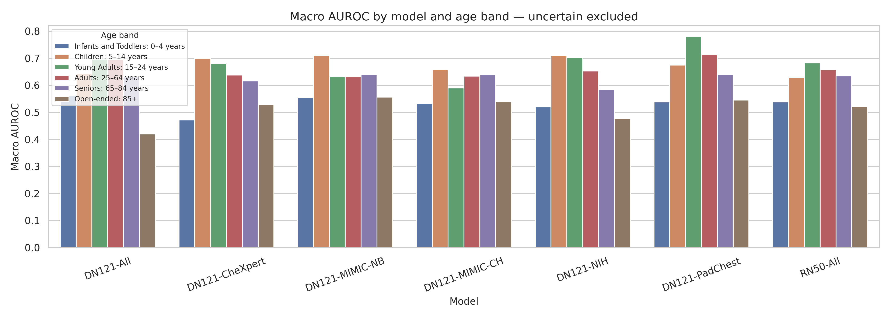

**Analysis:** This graph illustrates the Area Under the Receiver Operating Characteristic curve (AUROC), highlighting the model's ability to discriminate between positive and negative classes. In this evaluation setting, uncertain labels (typically marked as -1 in CheXpert-style datasets) are excluded from the metric computation, providing a clearer view of performance on definitive cases. This OOD comparison is critical for assessing real-world robustness, showing how different models degrade when exposed to new hospital systems or demographic shifts. The subgroup breakdown is essential for algorithmic fairness, ensuring that the model does not disproportionately underperform on specific demographic or clinical cohorts.

##### Figure 51: Subgroup Macro Auroc Age Band U0

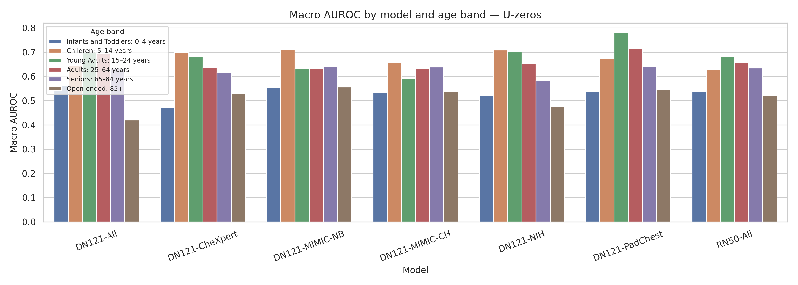

**Analysis:** This graph illustrates the Area Under the Receiver Operating Characteristic curve (AUROC), highlighting the model's ability to discriminate between positive and negative classes. Here, uncertain labels are mapped to negative (0), which represents a more conservative clinical assumption and tests the model's robustness against ambiguous ground truths. This OOD comparison is critical for assessing real-world robustness, showing how different models degrade when exposed to new hospital systems or demographic shifts. The subgroup breakdown is essential for algorithmic fairness, ensuring that the model does not disproportionately underperform on specific demographic or clinical cohorts.

##### Figure 52: Subgroup Macro Auroc Manufacturer Ignore Uncertain

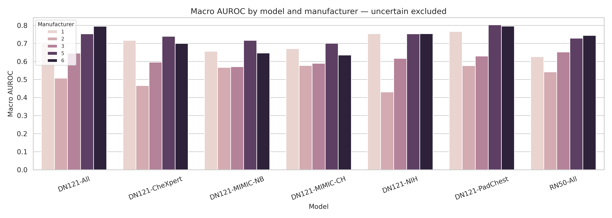

**Analysis:** This graph illustrates the Area Under the Receiver Operating Characteristic curve (AUROC), highlighting the model's ability to discriminate between positive and negative classes. In this evaluation setting, uncertain labels (typically marked as -1 in CheXpert-style datasets) are excluded from the metric computation, providing a clearer view of performance on definitive cases. This OOD comparison is critical for assessing real-world robustness, showing how different models degrade when exposed to new hospital systems or demographic shifts. The subgroup breakdown is essential for algorithmic fairness, ensuring that the model does not disproportionately underperform on specific demographic or clinical cohorts.

##### Figure 53: Subgroup Macro Auroc Manufacturer U0


**Analysis:** This graph illustrates the Area Under the Receiver Operating Characteristic curve (AUROC), highlighting the model's ability to discriminate between positive and negative classes. Here, uncertain labels are mapped to negative (0), which represents a more conservative clinical assumption and tests the model's robustness against ambiguous ground truths. This OOD comparison is critical for assessing real-world robustness, showing how different models degrade when exposed to new hospital systems or demographic shifts. The subgroup breakdown is essential for algorithmic fairness, ensuring that the model does not disproportionately underperform on specific demographic or clinical cohorts.

##### Figure 54: Subgroup Macro Auroc Sex Ignore Uncertain


**Analysis:** This graph illustrates the Area Under the Receiver Operating Characteristic curve (AUROC), highlighting the model's ability to discriminate between positive and negative classes. In this evaluation setting, uncertain labels (typically marked as -1 in CheXpert-style datasets) are excluded from the metric computation, providing a clearer view of performance on definitive cases. This OOD comparison is critical for assessing real-world robustness, showing how different models degrade when exposed to new hospital systems or demographic shifts. The subgroup breakdown is essential for algorithmic fairness, ensuring that the model does not disproportionately underperform on specific demographic or clinical cohorts.

##### Figure 55: Subgroup Macro Auroc Sex U0


**Analysis:** This graph illustrates the Area Under the Receiver Operating Characteristic curve (AUROC), highlighting the model's ability to discriminate between positive and negative classes. Here, uncertain labels are mapped to negative (0), which represents a more conservative clinical assumption and tests the model's robustness against ambiguous ground truths. This OOD comparison is critical for assessing real-world robustness, showing how different models degrade when exposed to new hospital systems or demographic shifts. The subgroup breakdown is essential for algorithmic fairness, ensuring that the model does not disproportionately underperform on specific demographic or clinical cohorts.

##### Figure 56: Subgroup Macro Auroc View Ignore Uncertain


**Analysis:** This graph illustrates the Area Under the Receiver Operating Characteristic curve (AUROC), highlighting the model's ability to discriminate between positive and negative classes. In this evaluation setting, uncertain labels (typically marked as -1 in CheXpert-style datasets) are excluded from the metric computation, providing a clearer view of performance on definitive cases. This OOD comparison is critical for assessing real-world robustness, showing how different models degrade when exposed to new hospital systems or demographic shifts. The subgroup breakdown is essential for algorithmic fairness, ensuring that the model does not disproportionately underperform on specific demographic or clinical cohorts.

##### Figure 57: Subgroup Macro Auroc View U0

**Analysis:** This graph illustrates the Area Under the Receiver Operating Characteristic curve (AUROC), highlighting the model's ability to discriminate between positive and negative classes. Here, uncertain labels are mapped to negative (0), which represents a more conservative clinical assumption and tests the model's robustness against ambiguous ground truths. This OOD comparison is critical for assessing real-world robustness, showing how different models degrade when exposed to new hospital systems or demographic shifts. The subgroup breakdown is essential for algorithmic fairness, ensuring that the model does not disproportionately underperform on specific demographic or clinical cohorts.

##### Figure 58: View Distribution


**Analysis:** This distribution chart outlines the demographic or clinical breakdown of the dataset, which is crucial for identifying potential biases or representation gaps in the evaluation cohort. This OOD comparison is critical for assessing real-world robustness, showing how different models degrade when exposed to new hospital systems or demographic shifts. Overall, this graph is a vital component of the holistic evaluation framework, contributing to a multi-faceted understanding of model reliability and clinical readiness.

#### Individual Model Results (ID)

##### Figure 59: Calibration Grid


**Analysis:** The calibration grid compares predicted probabilities against true empirical frequencies across different bins, indicating whether the model is overconfident or underconfident. These results are specific to the densenet121-res224-all architecture evaluated on the In-Distribution dataset, showcasing its individual predictive strengths and weaknesses. Overall, this graph is a vital component of the holistic evaluation framework, contributing to a multi-faceted understanding of model reliability and clinical readiness.

##### Figure 60: Pr Grid


**Analysis:** This plot displays the Area Under the Precision-Recall Curve (AUPRC), which is particularly informative for imbalanced datasets as it focuses on the positive predictive value. These results are specific to the densenet121-res224-all architecture evaluated on the In-Distribution dataset, showcasing its individual predictive strengths and weaknesses. Overall, this graph is a vital component of the holistic evaluation framework, contributing to a multi-faceted understanding of model reliability and clinical readiness.

##### Figure 61: Roc Grid


**Analysis:** This graph illustrates the Area Under the Receiver Operating Characteristic curve (AUROC), highlighting the model's ability to discriminate between positive and negative classes. These results are specific to the densenet121-res224-all architecture evaluated on the In-Distribution dataset, showcasing its individual predictive strengths and weaknesses. Overall, this graph is a vital component of the holistic evaluation framework, contributing to a multi-faceted understanding of model reliability and clinical readiness.

##### Figure 62: Calibration Grid


**Analysis:** The calibration grid compares predicted probabilities against true empirical frequencies across different bins, indicating whether the model is overconfident or underconfident. These results are specific to the densenet121-res224-all architecture evaluated on the In-Distribution dataset, showcasing its individual predictive strengths and weaknesses. Overall, this graph is a vital component of the holistic evaluation framework, contributing to a multi-faceted understanding of model reliability and clinical readiness.

##### Figure 63: Pr Grid


**Analysis:** This plot displays the Area Under the Precision-Recall Curve (AUPRC), which is particularly informative for imbalanced datasets as it focuses on the positive predictive value. These results are specific to the densenet121-res224-all architecture evaluated on the In-Distribution dataset, showcasing its individual predictive strengths and weaknesses. Overall, this graph is a vital component of the holistic evaluation framework, contributing to a multi-faceted understanding of model reliability and clinical readiness.

##### Figure 64: Roc Grid


**Analysis:** This graph illustrates the Area Under the Receiver Operating Characteristic curve (AUROC), highlighting the model's ability to discriminate between positive and negative classes. These results are specific to the densenet121-res224-all architecture evaluated on the In-Distribution dataset, showcasing its individual predictive strengths and weaknesses. Overall, this graph is a vital component of the holistic evaluation framework, contributing to a multi-faceted understanding of model reliability and clinical readiness.

##### Figure 65: Calibration Grid


**Analysis:** The calibration grid compares predicted probabilities against true empirical frequencies across different bins, indicating whether the model is overconfident or underconfident. These results are specific to the densenet121-res224-nih architecture evaluated on the In-Distribution dataset, showcasing its individual predictive strengths and weaknesses. Overall, this graph is a vital component of the holistic evaluation framework, contributing to a multi-faceted understanding of model reliability and clinical readiness.

##### Figure 66: Pr Grid


**Analysis:** This plot displays the Area Under the Precision-Recall Curve (AUPRC), which is particularly informative for imbalanced datasets as it focuses on the positive predictive value. These results are specific to the densenet121-res224-nih architecture evaluated on the In-Distribution dataset, showcasing its individual predictive strengths and weaknesses. Overall, this graph is a vital component of the holistic evaluation framework, contributing to a multi-faceted understanding of model reliability and clinical readiness.

##### Figure 67: Roc Grid


**Analysis:** This graph illustrates the Area Under the Receiver Operating Characteristic curve (AUROC), highlighting the model's ability to discriminate between positive and negative classes. These results are specific to the densenet121-res224-nih architecture evaluated on the In-Distribution dataset, showcasing its individual predictive strengths and weaknesses. Overall, this graph is a vital component of the holistic evaluation framework, contributing to a multi-faceted understanding of model reliability and clinical readiness.

##### Figure 68: Calibration Grid


**Analysis:** The calibration grid compares predicted probabilities against true empirical frequencies across different bins, indicating whether the model is overconfident or underconfident. These results are specific to the densenet121-res224-nih architecture evaluated on the In-Distribution dataset, showcasing its individual predictive strengths and weaknesses. Overall, this graph is a vital component of the holistic evaluation framework, contributing to a multi-faceted understanding of model reliability and clinical readiness.

##### Figure 69: Pr Grid


**Analysis:** This plot displays the Area Under the Precision-Recall Curve (AUPRC), which is particularly informative for imbalanced datasets as it focuses on the positive predictive value. These results are specific to the densenet121-res224-nih architecture evaluated on the In-Distribution dataset, showcasing its individual predictive strengths and weaknesses. Overall, this graph is a vital component of the holistic evaluation framework, contributing to a multi-faceted understanding of model reliability and clinical readiness.

##### Figure 70: Roc Grid


**Analysis:** This graph illustrates the Area Under the Receiver Operating Characteristic curve (AUROC), highlighting the model's ability to discriminate between positive and negative classes. These results are specific to the densenet121-res224-nih architecture evaluated on the In-Distribution dataset, showcasing its individual predictive strengths and weaknesses. Overall, this graph is a vital component of the holistic evaluation framework, contributing to a multi-faceted understanding of model reliability and clinical readiness.

##### Figure 71: Calibration Grid


**Analysis:** The calibration grid compares predicted probabilities against true empirical frequencies across different bins, indicating whether the model is overconfident or underconfident. These results are specific to the resnet50-res512-all architecture evaluated on the In-Distribution dataset, showcasing its individual predictive strengths and weaknesses. Overall, this graph is a vital component of the holistic evaluation framework, contributing to a multi-faceted understanding of model reliability and clinical readiness.

##### Figure 72: Pr Grid


**Analysis:** This plot displays the Area Under the Precision-Recall Curve (AUPRC), which is particularly informative for imbalanced datasets as it focuses on the positive predictive value. These results are specific to the resnet50-res512-all architecture evaluated on the In-Distribution dataset, showcasing its individual predictive strengths and weaknesses. Overall, this graph is a vital component of the holistic evaluation framework, contributing to a multi-faceted understanding of model reliability and clinical readiness.

##### Figure 73: Roc Grid


**Analysis:** This graph illustrates the Area Under the Receiver Operating Characteristic curve (AUROC), highlighting the model's ability to discriminate between positive and negative classes. These results are specific to the resnet50-res512-all architecture evaluated on the In-Distribution dataset, showcasing its individual predictive strengths and weaknesses. Overall, this graph is a vital component of the holistic evaluation framework, contributing to a multi-faceted understanding of model reliability and clinical readiness.

##### Figure 74: Calibration Grid

**Analysis:** The calibration grid compares predicted probabilities against true empirical frequencies across different bins, indicating whether the model is overconfident or underconfident. These results are specific to the resnet50-res512-all architecture evaluated on the In-Distribution dataset, showcasing its individual predictive strengths and weaknesses. Overall, this graph is a vital component of the holistic evaluation framework, contributing to a multi-faceted understanding of model reliability and clinical readiness.

##### Figure 75: Pr Grid


**Analysis:** This plot displays the Area Under the Precision-Recall Curve (AUPRC), which is particularly informative for imbalanced datasets as it focuses on the positive predictive value. These results are specific to the resnet50-res512-all architecture evaluated on the In-Distribution dataset, showcasing its individual predictive strengths and weaknesses. Overall, this graph is a vital component of the holistic evaluation framework, contributing to a multi-faceted understanding of model reliability and clinical readiness.

##### Figure 76: Roc Grid


**Analysis:** This graph illustrates the Area Under the Receiver Operating Characteristic curve (AUROC), highlighting the model's ability to discriminate between positive and negative classes. These results are specific to the resnet50-res512-all architecture evaluated on the In-Distribution dataset, showcasing its individual predictive strengths and weaknesses. Overall, this graph is a vital component of the holistic evaluation framework, contributing to a multi-faceted understanding of model reliability and clinical readiness.

#### Individual Model Results (OOD)

##### Figure 77: Calibration Grid


**Analysis:** The calibration grid compares predicted probabilities against true empirical frequencies across different bins, indicating whether the model is overconfident or underconfident. These results detail the performance of densenet121-res224-all on the Out-Of-Distribution dataset, revealing its specific failure modes and generalization capabilities under domain shift. Overall, this graph is a vital component of the holistic evaluation framework, contributing to a multi-faceted understanding of model reliability and clinical readiness.

##### Figure 78: Pr Grid


**Analysis:** This plot displays the Area Under the Precision-Recall Curve (AUPRC), which is particularly informative for imbalanced datasets as it focuses on the positive predictive value. These results detail the performance of densenet121-res224-all on the Out-Of-Distribution dataset, revealing its specific failure modes and generalization capabilities under domain shift. Overall, this graph is a vital component of the holistic evaluation framework, contributing to a multi-faceted understanding of model reliability and clinical readiness.

##### Figure 79: Roc Grid


**Analysis:** This graph illustrates the Area Under the Receiver Operating Characteristic curve (AUROC), highlighting the model's ability to discriminate between positive and negative classes. These results detail the performance of densenet121-res224-all on the Out-Of-Distribution dataset, revealing its specific failure modes and generalization capabilities under domain shift. Overall, this graph is a vital component of the holistic evaluation framework, contributing to a multi-faceted understanding of model reliability and clinical readiness.

##### Figure 80: Score Distributions


**Analysis:** This distribution chart outlines the demographic or clinical breakdown of the dataset, which is crucial for identifying potential biases or representation gaps in the evaluation cohort. These results detail the performance of densenet121-res224-all on the Out-Of-Distribution dataset, revealing its specific failure modes and generalization capabilities under domain shift. Overall, this graph is a vital component of the holistic evaluation framework, contributing to a multi-faceted understanding of model reliability and clinical readiness.

##### Figure 81: Calibration Grid


**Analysis:** The calibration grid compares predicted probabilities against true empirical frequencies across different bins, indicating whether the model is overconfident or underconfident. These results detail the performance of densenet121-res224-all on the Out-Of-Distribution dataset, revealing its specific failure modes and generalization capabilities under domain shift. Overall, this graph is a vital component of the holistic evaluation framework, contributing to a multi-faceted understanding of model reliability and clinical readiness.

##### Figure 82: Pr Grid


**Analysis:** This plot displays the Area Under the Precision-Recall Curve (AUPRC), which is particularly informative for imbalanced datasets as it focuses on the positive predictive value. These results detail the performance of densenet121-res224-all on the Out-Of-Distribution dataset, revealing its specific failure modes and generalization capabilities under domain shift. Overall, this graph is a vital component of the holistic evaluation framework, contributing to a multi-faceted understanding of model reliability and clinical readiness.

##### Figure 83: Roc Grid


**Analysis:** This graph illustrates the Area Under the Receiver Operating Characteristic curve (AUROC), highlighting the model's ability to discriminate between positive and negative classes. These results detail the performance of densenet121-res224-all on the Out-Of-Distribution dataset, revealing its specific failure modes and generalization capabilities under domain shift. Overall, this graph is a vital component of the holistic evaluation framework, contributing to a multi-faceted understanding of model reliability and clinical readiness.

##### Figure 84: Score Distributions


**Analysis:** This distribution chart outlines the demographic or clinical breakdown of the dataset, which is crucial for identifying potential biases or representation gaps in the evaluation cohort. These results detail the performance of densenet121-res224-all on the Out-Of-Distribution dataset, revealing its specific failure modes and generalization capabilities under domain shift. Overall, this graph is a vital component of the holistic evaluation framework, contributing to a multi-faceted understanding of model reliability and clinical readiness.

##### Figure 85: Calibration Grid


**Analysis:** The calibration grid compares predicted probabilities against true empirical frequencies across different bins, indicating whether the model is overconfident or underconfident. These results detail the performance of densenet121-res224-chex on the Out-Of-Distribution dataset, revealing its specific failure modes and generalization capabilities under domain shift. Overall, this graph is a vital component of the holistic evaluation framework, contributing to a multi-faceted understanding of model reliability and clinical readiness.

##### Figure 86: Pr Grid


**Analysis:** This plot displays the Area Under the Precision-Recall Curve (AUPRC), which is particularly informative for imbalanced datasets as it focuses on the positive predictive value. These results detail the performance of densenet121-res224-chex on the Out-Of-Distribution dataset, revealing its specific failure modes and generalization capabilities under domain shift. Overall, this graph is a vital component of the holistic evaluation framework, contributing to a multi-faceted understanding of model reliability and clinical readiness.

##### Figure 87: Roc Grid


**Analysis:** This graph illustrates the Area Under the Receiver Operating Characteristic curve (AUROC), highlighting the model's ability to discriminate between positive and negative classes. These results detail the performance of densenet121-res224-chex on the Out-Of-Distribution dataset, revealing its specific failure modes and generalization capabilities under domain shift. Overall, this graph is a vital component of the holistic evaluation framework, contributing to a multi-faceted understanding of model reliability and clinical readiness.

##### Figure 88: Score Distributions


**Analysis:** This distribution chart outlines the demographic or clinical breakdown of the dataset, which is crucial for identifying potential biases or representation gaps in the evaluation cohort. These results detail the performance of densenet121-res224-chex on the Out-Of-Distribution dataset, revealing its specific failure modes and generalization capabilities under domain shift. Overall, this graph is a vital component of the holistic evaluation framework, contributing to a multi-faceted understanding of model reliability and clinical readiness.

##### Figure 89: Calibration Grid


**Analysis:** The calibration grid compares predicted probabilities against true empirical frequencies across different bins, indicating whether the model is overconfident or underconfident. These results detail the performance of densenet121-res224-chex on the Out-Of-Distribution dataset, revealing its specific failure modes and generalization capabilities under domain shift. Overall, this graph is a vital component of the holistic evaluation framework, contributing to a multi-faceted understanding of model reliability and clinical readiness.

##### Figure 90: Pr Grid


**Analysis:** This plot displays the Area Under the Precision-Recall Curve (AUPRC), which is particularly informative for imbalanced datasets as it focuses on the positive predictive value. These results detail the performance of densenet121-res224-chex on the Out-Of-Distribution dataset, revealing its specific failure modes and generalization capabilities under domain shift. Overall, this graph is a vital component of the holistic evaluation framework, contributing to a multi-faceted understanding of model reliability and clinical readiness.

##### Figure 91: Roc Grid


**Analysis:** This graph illustrates the Area Under the Receiver Operating Characteristic curve (AUROC), highlighting the model's ability to discriminate between positive and negative classes. These results detail the performance of densenet121-res224-chex on the Out-Of-Distribution dataset, revealing its specific failure modes and generalization capabilities under domain shift. Overall, this graph is a vital component of the holistic evaluation framework, contributing to a multi-faceted understanding of model reliability and clinical readiness.

##### Figure 92: Score Distributions

**Analysis:** This distribution chart outlines the demographic or clinical breakdown of the dataset, which is crucial for identifying potential biases or representation gaps in the evaluation cohort. These results detail the performance of densenet121-res224-chex on the Out-Of-Distribution dataset, revealing its specific failure modes and generalization capabilities under domain shift. Overall, this graph is a vital component of the holistic evaluation framework, contributing to a multi-faceted understanding of model reliability and clinical readiness.

##### Figure 93: Calibration Grid


**Analysis:** The calibration grid compares predicted probabilities against true empirical frequencies across different bins, indicating whether the model is overconfident or underconfident. These results detail the performance of densenet121-res224-mimic_ch on the Out-Of-Distribution dataset, revealing its specific failure modes and generalization capabilities under domain shift. Overall, this graph is a vital component of the holistic evaluation framework, contributing to a multi-faceted understanding of model reliability and clinical readiness.

##### Figure 94: Pr Grid


**Analysis:** This plot displays the Area Under the Precision-Recall Curve (AUPRC), which is particularly informative for imbalanced datasets as it focuses on the positive predictive value. These results detail the performance of densenet121-res224-mimic_ch on the Out-Of-Distribution dataset, revealing its specific failure modes and generalization capabilities under domain shift. Overall, this graph is a vital component of the holistic evaluation framework, contributing to a multi-faceted understanding of model reliability and clinical readiness.

##### Figure 95: Roc Grid


**Analysis:** This graph illustrates the Area Under the Receiver Operating Characteristic curve (AUROC), highlighting the model's ability to discriminate between positive and negative classes. These results detail the performance of densenet121-res224-mimic_ch on the Out-Of-Distribution dataset, revealing its specific failure modes and generalization capabilities under domain shift. Overall, this graph is a vital component of the holistic evaluation framework, contributing to a multi-faceted understanding of model reliability and clinical readiness.

##### Figure 96: Score Distributions


**Analysis:** This distribution chart outlines the demographic or clinical breakdown of the dataset, which is crucial for identifying potential biases or representation gaps in the evaluation cohort. These results detail the performance of densenet121-res224-mimic_ch on the Out-Of-Distribution dataset, revealing its specific failure modes and generalization capabilities under domain shift. Overall, this graph is a vital component of the holistic evaluation framework, contributing to a multi-faceted understanding of model reliability and clinical readiness.

##### Figure 97: Calibration Grid


**Analysis:** The calibration grid compares predicted probabilities against true empirical frequencies across different bins, indicating whether the model is overconfident or underconfident. These results detail the performance of densenet121-res224-mimic_ch on the Out-Of-Distribution dataset, revealing its specific failure modes and generalization capabilities under domain shift. Overall, this graph is a vital component of the holistic evaluation framework, contributing to a multi-faceted understanding of model reliability and clinical readiness.

##### Figure 98: Pr Grid


**Analysis:** This plot displays the Area Under the Precision-Recall Curve (AUPRC), which is particularly informative for imbalanced datasets as it focuses on the positive predictive value. These results detail the performance of densenet121-res224-mimic_ch on the Out-Of-Distribution dataset, revealing its specific failure modes and generalization capabilities under domain shift. Overall, this graph is a vital component of the holistic evaluation framework, contributing to a multi-faceted understanding of model reliability and clinical readiness.

##### Figure 99: Roc Grid


**Analysis:** This graph illustrates the Area Under the Receiver Operating Characteristic curve (AUROC), highlighting the model's ability to discriminate between positive and negative classes. These results detail the performance of densenet121-res224-mimic_ch on the Out-Of-Distribution dataset, revealing its specific failure modes and generalization capabilities under domain shift. Overall, this graph is a vital component of the holistic evaluation framework, contributing to a multi-faceted understanding of model reliability and clinical readiness.

##### Figure 100: Score Distributions


**Analysis:** This distribution chart outlines the demographic or clinical breakdown of the dataset, which is crucial for identifying potential biases or representation gaps in the evaluation cohort. These results detail the performance of densenet121-res224-mimic_ch on the Out-Of-Distribution dataset, revealing its specific failure modes and generalization capabilities under domain shift. Overall, this graph is a vital component of the holistic evaluation framework, contributing to a multi-faceted understanding of model reliability and clinical readiness.

##### Figure 101: Calibration Grid


**Analysis:** The calibration grid compares predicted probabilities against true empirical frequencies across different bins, indicating whether the model is overconfident or underconfident. These results detail the performance of densenet121-res224-mimic_nb on the Out-Of-Distribution dataset, revealing its specific failure modes and generalization capabilities under domain shift. Overall, this graph is a vital component of the holistic evaluation framework, contributing to a multi-faceted understanding of model reliability and clinical readiness.

##### Figure 102: Pr Grid


**Analysis:** This plot displays the Area Under the Precision-Recall Curve (AUPRC), which is particularly informative for imbalanced datasets as it focuses on the positive predictive value. These results detail the performance of densenet121-res224-mimic_nb on the Out-Of-Distribution dataset, revealing its specific failure modes and generalization capabilities under domain shift. Overall, this graph is a vital component of the holistic evaluation framework, contributing to a multi-faceted understanding of model reliability and clinical readiness.

##### Figure 103: Roc Grid


**Analysis:** This graph illustrates the Area Under the Receiver Operating Characteristic curve (AUROC), highlighting the model's ability to discriminate between positive and negative classes. These results detail the performance of densenet121-res224-mimic_nb on the Out-Of-Distribution dataset, revealing its specific failure modes and generalization capabilities under domain shift. Overall, this graph is a vital component of the holistic evaluation framework, contributing to a multi-faceted understanding of model reliability and clinical readiness.

##### Figure 104: Score Distributions

**Analysis:** This distribution chart outlines the demographic or clinical breakdown of the dataset, which is crucial for identifying potential biases or representation gaps in the evaluation cohort. These results detail the performance of densenet121-res224-mimic_nb on the Out-Of-Distribution dataset, revealing its specific failure modes and generalization capabilities under domain shift. Overall, this graph is a vital component of the holistic evaluation framework, contributing to a multi-faceted understanding of model reliability and clinical readiness.

##### Figure 105: Calibration Grid


**Analysis:** The calibration grid compares predicted probabilities against true empirical frequencies across different bins, indicating whether the model is overconfident or underconfident. These results detail the performance of densenet121-res224-mimic_nb on the Out-Of-Distribution dataset, revealing its specific failure modes and generalization capabilities under domain shift. Overall, this graph is a vital component of the holistic evaluation framework, contributing to a multi-faceted understanding of model reliability and clinical readiness.

##### Figure 106: Pr Grid


**Analysis:** This plot displays the Area Under the Precision-Recall Curve (AUPRC), which is particularly informative for imbalanced datasets as it focuses on the positive predictive value. These results detail the performance of densenet121-res224-mimic_nb on the Out-Of-Distribution dataset, revealing its specific failure modes and generalization capabilities under domain shift. Overall, this graph is a vital component of the holistic evaluation framework, contributing to a multi-faceted understanding of model reliability and clinical readiness.

##### Figure 107: Roc Grid


**Analysis:** This graph illustrates the Area Under the Receiver Operating Characteristic curve (AUROC), highlighting the model's ability to discriminate between positive and negative classes. These results detail the performance of densenet121-res224-mimic_nb on the Out-Of-Distribution dataset, revealing its specific failure modes and generalization capabilities under domain shift. Overall, this graph is a vital component of the holistic evaluation framework, contributing to a multi-faceted understanding of model reliability and clinical readiness.

##### Figure 108: Score Distributions


**Analysis:** This distribution chart outlines the demographic or clinical breakdown of the dataset, which is crucial for identifying potential biases or representation gaps in the evaluation cohort. These results detail the performance of densenet121-res224-mimic_nb on the Out-Of-Distribution dataset, revealing its specific failure modes and generalization capabilities under domain shift. Overall, this graph is a vital component of the holistic evaluation framework, contributing to a multi-faceted understanding of model reliability and clinical readiness.

##### Figure 109: Calibration Grid


**Analysis:** The calibration grid compares predicted probabilities against true empirical frequencies across different bins, indicating whether the model is overconfident or underconfident. These results detail the performance of densenet121-res224-nih on the Out-Of-Distribution dataset, revealing its specific failure modes and generalization capabilities under domain shift. Overall, this graph is a vital component of the holistic evaluation framework, contributing to a multi-faceted understanding of model reliability and clinical readiness.

##### Figure 110: Pr Grid


**Analysis:** This plot displays the Area Under the Precision-Recall Curve (AUPRC), which is particularly informative for imbalanced datasets as it focuses on the positive predictive value. These results detail the performance of densenet121-res224-nih on the Out-Of-Distribution dataset, revealing its specific failure modes and generalization capabilities under domain shift. Overall, this graph is a vital component of the holistic evaluation framework, contributing to a multi-faceted understanding of model reliability and clinical readiness.

##### Figure 111: Roc Grid


**Analysis:** This graph illustrates the Area Under the Receiver Operating Characteristic curve (AUROC), highlighting the model's ability to discriminate between positive and negative classes. These results detail the performance of densenet121-res224-nih on the Out-Of-Distribution dataset, revealing its specific failure modes and generalization capabilities under domain shift. Overall, this graph is a vital component of the holistic evaluation framework, contributing to a multi-faceted understanding of model reliability and clinical readiness.

##### Figure 112: Score Distributions


**Analysis:** This distribution chart outlines the demographic or clinical breakdown of the dataset, which is crucial for identifying potential biases or representation gaps in the evaluation cohort. These results detail the performance of densenet121-res224-nih on the Out-Of-Distribution dataset, revealing its specific failure modes and generalization capabilities under domain shift. Overall, this graph is a vital component of the holistic evaluation framework, contributing to a multi-faceted understanding of model reliability and clinical readiness.

##### Figure 113: Calibration Grid


**Analysis:** The calibration grid compares predicted probabilities against true empirical frequencies across different bins, indicating whether the model is overconfident or underconfident. These results detail the performance of densenet121-res224-nih on the Out-Of-Distribution dataset, revealing its specific failure modes and generalization capabilities under domain shift. Overall, this graph is a vital component of the holistic evaluation framework, contributing to a multi-faceted understanding of model reliability and clinical readiness.

##### Figure 114: Pr Grid


**Analysis:** This plot displays the Area Under the Precision-Recall Curve (AUPRC), which is particularly informative for imbalanced datasets as it focuses on the positive predictive value. These results detail the performance of densenet121-res224-nih on the Out-Of-Distribution dataset, revealing its specific failure modes and generalization capabilities under domain shift. Overall, this graph is a vital component of the holistic evaluation framework, contributing to a multi-faceted understanding of model reliability and clinical readiness.

##### Figure 115: Roc Grid


**Analysis:** This graph illustrates the Area Under the Receiver Operating Characteristic curve (AUROC), highlighting the model's ability to discriminate between positive and negative classes. These results detail the performance of densenet121-res224-nih on the Out-Of-Distribution dataset, revealing its specific failure modes and generalization capabilities under domain shift. Overall, this graph is a vital component of the holistic evaluation framework, contributing to a multi-faceted understanding of model reliability and clinical readiness.

##### Figure 116: Score Distributions


**Analysis:** This distribution chart outlines the demographic or clinical breakdown of the dataset, which is crucial for identifying potential biases or representation gaps in the evaluation cohort. These results detail the performance of densenet121-res224-nih on the Out-Of-Distribution dataset, revealing its specific failure modes and generalization capabilities under domain shift. Overall, this graph is a vital component of the holistic evaluation framework, contributing to a multi-faceted understanding of model reliability and clinical readiness.

##### Figure 117: Calibration Grid


**Analysis:** The calibration grid compares predicted probabilities against true empirical frequencies across different bins, indicating whether the model is overconfident or underconfident. These results detail the performance of densenet121-res224-pc on the Out-Of-Distribution dataset, revealing its specific failure modes and generalization capabilities under domain shift. Overall, this graph is a vital component of the holistic evaluation framework, contributing to a multi-faceted understanding of model reliability and clinical readiness.

##### Figure 118: Pr Grid


**Analysis:** This plot displays the Area Under the Precision-Recall Curve (AUPRC), which is particularly informative for imbalanced datasets as it focuses on the positive predictive value. These results detail the performance of densenet121-res224-pc on the Out-Of-Distribution dataset, revealing its specific failure modes and generalization capabilities under domain shift. Overall, this graph is a vital component of the holistic evaluation framework, contributing to a multi-faceted understanding of model reliability and clinical readiness.

##### Figure 119: Roc Grid


**Analysis:** This graph illustrates the Area Under the Receiver Operating Characteristic curve (AUROC), highlighting the model's ability to discriminate between positive and negative classes. These results detail the performance of densenet121-res224-pc on the Out-Of-Distribution dataset, revealing its specific failure modes and generalization capabilities under domain shift. Overall, this graph is a vital component of the holistic evaluation framework, contributing to a multi-faceted understanding of model reliability and clinical readiness.

##### Figure 120: Score Distributions


**Analysis:** This distribution chart outlines the demographic or clinical breakdown of the dataset, which is crucial for identifying potential biases or representation gaps in the evaluation cohort. These results detail the performance of densenet121-res224-pc on the Out-Of-Distribution dataset, revealing its specific failure modes and generalization capabilities under domain shift. Overall, this graph is a vital component of the holistic evaluation framework, contributing to a multi-faceted understanding of model reliability and clinical readiness.

##### Figure 121: Calibration Grid


**Analysis:** The calibration grid compares predicted probabilities against true empirical frequencies across different bins, indicating whether the model is overconfident or underconfident. These results detail the performance of densenet121-res224-pc on the Out-Of-Distribution dataset, revealing its specific failure modes and generalization capabilities under domain shift. Overall, this graph is a vital component of the holistic evaluation framework, contributing to a multi-faceted understanding of model reliability and clinical readiness.

##### Figure 122: Pr Grid


**Analysis:** This plot displays the Area Under the Precision-Recall Curve (AUPRC), which is particularly informative for imbalanced datasets as it focuses on the positive predictive value. These results detail the performance of densenet121-res224-pc on the Out-Of-Distribution dataset, revealing its specific failure modes and generalization capabilities under domain shift. Overall, this graph is a vital component of the holistic evaluation framework, contributing to a multi-faceted understanding of model reliability and clinical readiness.

##### Figure 123: Roc Grid


**Analysis:** This graph illustrates the Area Under the Receiver Operating Characteristic curve (AUROC), highlighting the model's ability to discriminate between positive and negative classes. These results detail the performance of densenet121-res224-pc on the Out-Of-Distribution dataset, revealing its specific failure modes and generalization capabilities under domain shift. Overall, this graph is a vital component of the holistic evaluation framework, contributing to a multi-faceted understanding of model reliability and clinical readiness.

##### Figure 124: Score Distributions


**Analysis:** This distribution chart outlines the demographic or clinical breakdown of the dataset, which is crucial for identifying potential biases or representation gaps in the evaluation cohort. These results detail the performance of densenet121-res224-pc on the Out-Of-Distribution dataset, revealing its specific failure modes and generalization capabilities under domain shift. Overall, this graph is a vital component of the holistic evaluation framework, contributing to a multi-faceted understanding of model reliability and clinical readiness.

##### Figure 125: Calibration Grid


**Analysis:** The calibration grid compares predicted probabilities against true empirical frequencies across different bins, indicating whether the model is overconfident or underconfident. These results detail the performance of resnet50-res512-all on the Out-Of-Distribution dataset, revealing its specific failure modes and generalization capabilities under domain shift. Overall, this graph is a vital component of the holistic evaluation framework, contributing to a multi-faceted understanding of model reliability and clinical readiness.

##### Figure 126: Pr Grid


**Analysis:** This plot displays the Area Under the Precision-Recall Curve (AUPRC), which is particularly informative for imbalanced datasets as it focuses on the positive predictive value. These results detail the performance of resnet50-res512-all on the Out-Of-Distribution dataset, revealing its specific failure modes and generalization capabilities under domain shift. Overall, this graph is a vital component of the holistic evaluation framework, contributing to a multi-faceted understanding of model reliability and clinical readiness.

##### Figure 127: Roc Grid


**Analysis:** This graph illustrates the Area Under the Receiver Operating Characteristic curve (AUROC), highlighting the model's ability to discriminate between positive and negative classes. These results detail the performance of resnet50-res512-all on the Out-Of-Distribution dataset, revealing its specific failure modes and generalization capabilities under domain shift. Overall, this graph is a vital component of the holistic evaluation framework, contributing to a multi-faceted understanding of model reliability and clinical readiness.

##### Figure 128: Score Distributions


**Analysis:** This distribution chart outlines the demographic or clinical breakdown of the dataset, which is crucial for identifying potential biases or representation gaps in the evaluation cohort. These results detail the performance of resnet50-res512-all on the Out-Of-Distribution dataset, revealing its specific failure modes and generalization capabilities under domain shift. Overall, this graph is a vital component of the holistic evaluation framework, contributing to a multi-faceted understanding of model reliability and clinical readiness.

##### Figure 129: Calibration Grid


**Analysis:** The calibration grid compares predicted probabilities against true empirical frequencies across different bins, indicating whether the model is overconfident or underconfident. These results detail the performance of resnet50-res512-all on the Out-Of-Distribution dataset, revealing its specific failure modes and generalization capabilities under domain shift. Overall, this graph is a vital component of the holistic evaluation framework, contributing to a multi-faceted understanding of model reliability and clinical readiness.

##### Figure 130: Pr Grid


**Analysis:** This plot displays the Area Under the Precision-Recall Curve (AUPRC), which is particularly informative for imbalanced datasets as it focuses on the positive predictive value. These results detail the performance of resnet50-res512-all on the Out-Of-Distribution dataset, revealing its specific failure modes and generalization capabilities under domain shift. Overall, this graph is a vital component of the holistic evaluation framework, contributing to a multi-faceted understanding of model reliability and clinical readiness.

##### Figure 131: Roc Grid


**Analysis:** This graph illustrates the Area Under the Receiver Operating Characteristic curve (AUROC), highlighting the model's ability to discriminate between positive and negative classes. These results detail the performance of resnet50-res512-all on the Out-Of-Distribution dataset, revealing its specific failure modes and generalization capabilities under domain shift. Overall, this graph is a vital component of the holistic evaluation framework, contributing to a multi-faceted understanding of model reliability and clinical readiness.

##### Figure 132: Score Distributions


**Analysis:** This distribution chart outlines the demographic or clinical breakdown of the dataset, which is crucial for identifying potential biases or representation gaps in the evaluation cohort. These results detail the performance of resnet50-res512-all on the Out-Of-Distribution dataset, revealing its specific failure modes and generalization capabilities under domain shift. Overall, this graph is a vital component of the holistic evaluation framework, contributing to a multi-faceted understanding of model reliability and clinical readiness.

#### OOD vs ID Comparison

##### Figure 133: Id Vs Ood Auprc Ignore Uncertain

**Analysis:** This plot displays the Area Under the Precision-Recall Curve (AUPRC), which is particularly informative for imbalanced datasets as it focuses on the positive predictive value. In this evaluation setting, uncertain labels (typically marked as -1 in CheXpert-style datasets) are excluded from the metric computation, providing a clearer view of performance on definitive cases. By directly comparing In-Distribution (ID) and Out-Of-Distribution (OOD) performance, this graph highlights the generalization gap and potential domain shift vulnerabilities of the models. Overall, this graph is a vital component of the holistic evaluation framework, contributing to a multi-faceted understanding of model reliability and clinical readiness.

##### Figure 134: Id Vs Ood Auprc U0


**Analysis:** This plot displays the Area Under the Precision-Recall Curve (AUPRC), which is particularly informative for imbalanced datasets as it focuses on the positive predictive value. Here, uncertain labels are mapped to negative (0), which represents a more conservative clinical assumption and tests the model's robustness against ambiguous ground truths. By directly comparing In-Distribution (ID) and Out-Of-Distribution (OOD) performance, this graph highlights the generalization gap and potential domain shift vulnerabilities of the models. Overall, this graph is a vital component of the holistic evaluation framework, contributing to a multi-faceted understanding of model reliability and clinical readiness.

##### Figure 135: Id Vs Ood Auroc Ignore Uncertain

**Analysis:** This graph illustrates the Area Under the Receiver Operating Characteristic curve (AUROC), highlighting the model's ability to discriminate between positive and negative classes. In this evaluation setting, uncertain labels (typically marked as -1 in CheXpert-style datasets) are excluded from the metric computation, providing a clearer view of performance on definitive cases. By directly comparing In-Distribution (ID) and Out-Of-Distribution (OOD) performance, this graph highlights the generalization gap and potential domain shift vulnerabilities of the models. Overall, this graph is a vital component of the holistic evaluation framework, contributing to a multi-faceted understanding of model reliability and clinical readiness.

##### Figure 136: Id Vs Ood Auroc U0


**Analysis:** This graph illustrates the Area Under the Receiver Operating Characteristic curve (AUROC), highlighting the model's ability to discriminate between positive and negative classes. Here, uncertain labels are mapped to negative (0), which represents a more conservative clinical assumption and tests the model's robustness against ambiguous ground truths. By directly comparing In-Distribution (ID) and Out-Of-Distribution (OOD) performance, this graph highlights the generalization gap and potential domain shift vulnerabilities of the models. Overall, this graph is a vital component of the holistic evaluation framework, contributing to a multi-faceted understanding of model reliability and clinical readiness.

##### Figure 137: Id Vs Ood Brier Ignore Uncertain


**Analysis:** This visualization shows the Brier score, providing a measure of the accuracy of probabilistic predictions (calibration and sharpness). In this evaluation setting, uncertain labels (typically marked as -1 in CheXpert-style datasets) are excluded from the metric computation, providing a clearer view of performance on definitive cases. By directly comparing In-Distribution (ID) and Out-Of-Distribution (OOD) performance, this graph highlights the generalization gap and potential domain shift vulnerabilities of the models. Overall, this graph is a vital component of the holistic evaluation framework, contributing to a multi-faceted understanding of model reliability and clinical readiness.

##### Figure 138: Id Vs Ood Brier U0

**Analysis:** This visualization shows the Brier score, providing a measure of the accuracy of probabilistic predictions (calibration and sharpness). Here, uncertain labels are mapped to negative (0), which represents a more conservative clinical assumption and tests the model's robustness against ambiguous ground truths. By directly comparing In-Distribution (ID) and Out-Of-Distribution (OOD) performance, this graph highlights the generalization gap and potential domain shift vulnerabilities of the models. Overall, this graph is a vital component of the holistic evaluation framework, contributing to a multi-faceted understanding of model reliability and clinical readiness.

##### Figure 139: Id Vs Ood Ece Ignore Uncertain

**Analysis:** This graph presents the Expected Calibration Error (ECE), quantifying how well the predicted probabilities align with the actual observed frequencies. In this evaluation setting, uncertain labels (typically marked as -1 in CheXpert-style datasets) are excluded from the metric computation, providing a clearer view of performance on definitive cases. By directly comparing In-Distribution (ID) and Out-Of-Distribution (OOD) performance, this graph highlights the generalization gap and potential domain shift vulnerabilities of the models. Overall, this graph is a vital component of the holistic evaluation framework, contributing to a multi-faceted understanding of model reliability and clinical readiness.

##### Figure 140: Id Vs Ood Ece U0


**Analysis:** This graph presents the Expected Calibration Error (ECE), quantifying how well the predicted probabilities align with the actual observed frequencies. Here, uncertain labels are mapped to negative (0), which represents a more conservative clinical assumption and tests the model's robustness against ambiguous ground truths. By directly comparing In-Distribution (ID) and Out-Of-Distribution (OOD) performance, this graph highlights the generalization gap and potential domain shift vulnerabilities of the models. Overall, this graph is a vital component of the holistic evaluation framework, contributing to a multi-faceted understanding of model reliability and clinical readiness.

### 2.3 Confusion Matrices

#### RESULTS_ID - densenet121-res224-all - Atelectasis

#### RESULTS_ID - densenet121-res224-all - Cardiomegaly

#### RESULTS_ID - densenet121-res224-all - Consolidation


#### RESULTS_ID - densenet121-res224-all - Edema

#### RESULTS_ID - densenet121-res224-all - Effusion


#### RESULTS_ID - densenet121-res224-all - Emphysema


#### RESULTS_ID - densenet121-res224-all - Fibrosis

#### RESULTS_ID - densenet121-res224-all - Hernia


#### RESULTS_ID - densenet121-res224-all - Infiltration

#### RESULTS_ID - densenet121-res224-all - Mass


#### RESULTS_ID - densenet121-res224-all - Nodule

#### RESULTS_ID - densenet121-res224-all - Pleural Thickening


#### RESULTS_ID - densenet121-res224-all - Pneumonia

#### RESULTS_ID - densenet121-res224-all - Pneumothorax

#### RESULTS_ID - densenet121-res224-all - grid all pathologies


#### RESULTS_ID - densenet121-res224-all - overall aggregated


#### RESULTS_ID - densenet121-res224-nih - Atelectasis

#### RESULTS_ID - densenet121-res224-nih - Cardiomegaly


#### RESULTS_ID - densenet121-res224-nih - Consolidation

#### RESULTS_ID - densenet121-res224-nih - Edema

#### RESULTS_ID - densenet121-res224-nih - Effusion

#### RESULTS_ID - densenet121-res224-nih - Emphysema

#### RESULTS_ID - densenet121-res224-nih - Fibrosis

#### RESULTS_ID - densenet121-res224-nih - Hernia


#### RESULTS_ID - densenet121-res224-nih - Infiltration


#### RESULTS_ID - densenet121-res224-nih - Mass


#### RESULTS_ID - densenet121-res224-nih - Nodule

#### RESULTS_ID - densenet121-res224-nih - Pleural Thickening

#### RESULTS_ID - densenet121-res224-nih - Pneumonia

#### RESULTS_ID - densenet121-res224-nih - Pneumothorax

#### RESULTS_ID - densenet121-res224-nih - grid all pathologies


#### RESULTS_ID - densenet121-res224-nih - overall aggregated


#### RESULTS_ID - resnet50-res512-all - Atelectasis


#### RESULTS_ID - resnet50-res512-all - Cardiomegaly

#### RESULTS_ID - resnet50-res512-all - Consolidation

#### RESULTS_ID - resnet50-res512-all - Edema

#### RESULTS_ID - resnet50-res512-all - Effusion


#### RESULTS_ID - resnet50-res512-all - Emphysema

#### RESULTS_ID - resnet50-res512-all - Fibrosis

#### RESULTS_ID - resnet50-res512-all - Hernia

#### RESULTS_ID - resnet50-res512-all - Infiltration


#### RESULTS_ID - resnet50-res512-all - Mass


#### RESULTS_ID - resnet50-res512-all - Nodule

#### RESULTS_ID - resnet50-res512-all - Pleural Thickening

#### RESULTS_ID - resnet50-res512-all - Pneumonia

#### RESULTS_ID - resnet50-res512-all - Pneumothorax

#### RESULTS_ID - resnet50-res512-all - grid all pathologies


#### RESULTS_ID - resnet50-res512-all - overall aggregated


#### RESULTS_OOD - densenet121-res224-all - Atelectasis

#### RESULTS_OOD - densenet121-res224-all - Cardiomegaly

#### RESULTS_OOD - densenet121-res224-all - Consolidation


#### RESULTS_OOD - densenet121-res224-all - Edema


#### RESULTS_OOD - densenet121-res224-all - Enlarged Cardiomediastinum


#### RESULTS_OOD - densenet121-res224-all - Fracture


#### RESULTS_OOD - densenet121-res224-all - Lung Lesion


#### RESULTS_OOD - densenet121-res224-all - Lung Opacity

#### RESULTS_OOD - densenet121-res224-all - Pneumonia


#### RESULTS_OOD - densenet121-res224-all - Pneumothorax

#### RESULTS_OOD - densenet121-res224-all - grid all pathologies


#### RESULTS_OOD - densenet121-res224-all - overall aggregated

#### RESULTS_OOD - densenet121-res224-chex - Atelectasis


#### RESULTS_OOD - densenet121-res224-chex - Cardiomegaly

#### RESULTS_OOD - densenet121-res224-chex - Consolidation

#### RESULTS_OOD - densenet121-res224-chex - Edema

#### RESULTS_OOD - densenet121-res224-chex - Enlarged Cardiomediastinum

#### RESULTS_OOD - densenet121-res224-chex - Fracture


#### RESULTS_OOD - densenet121-res224-chex - Lung Lesion


#### RESULTS_OOD - densenet121-res224-chex - Lung Opacity


#### RESULTS_OOD - densenet121-res224-chex - Pneumonia

#### RESULTS_OOD - densenet121-res224-chex - Pneumothorax

#### RESULTS_OOD - densenet121-res224-chex - grid all pathologies


#### RESULTS_OOD - densenet121-res224-chex - overall aggregated


#### RESULTS_OOD - densenet121-res224-mimic_ch - Atelectasis

#### RESULTS_OOD - densenet121-res224-mimic_ch - Cardiomegaly

#### RESULTS_OOD - densenet121-res224-mimic_ch - Consolidation

#### RESULTS_OOD - densenet121-res224-mimic_ch - Edema


#### RESULTS_OOD - densenet121-res224-mimic_ch - Enlarged Cardiomediastinum


#### RESULTS_OOD - densenet121-res224-mimic_ch - Fracture

#### RESULTS_OOD - densenet121-res224-mimic_ch - Lung Lesion

#### RESULTS_OOD - densenet121-res224-mimic_ch - Lung Opacity

#### RESULTS_OOD - densenet121-res224-mimic_ch - Pneumonia

#### RESULTS_OOD - densenet121-res224-mimic_ch - Pneumothorax


#### RESULTS_OOD - densenet121-res224-mimic_ch - grid all pathologies


#### RESULTS_OOD - densenet121-res224-mimic_ch - overall aggregated

#### RESULTS_OOD - densenet121-res224-mimic_nb - Atelectasis


#### RESULTS_OOD - densenet121-res224-mimic_nb - Cardiomegaly

#### RESULTS_OOD - densenet121-res224-mimic_nb - Consolidation

#### RESULTS_OOD - densenet121-res224-mimic_nb - Edema

#### RESULTS_OOD - densenet121-res224-mimic_nb - Enlarged Cardiomediastinum


#### RESULTS_OOD - densenet121-res224-mimic_nb - Fracture


#### RESULTS_OOD - densenet121-res224-mimic_nb - Lung Lesion


#### RESULTS_OOD - densenet121-res224-mimic_nb - Lung Opacity

#### RESULTS_OOD - densenet121-res224-mimic_nb - Pneumonia

#### RESULTS_OOD - densenet121-res224-mimic_nb - Pneumothorax

#### RESULTS_OOD - densenet121-res224-mimic_nb - grid all pathologies


#### RESULTS_OOD - densenet121-res224-mimic_nb - overall aggregated


#### RESULTS_OOD - densenet121-res224-nih - Atelectasis


#### RESULTS_OOD - densenet121-res224-nih - Cardiomegaly


#### RESULTS_OOD - densenet121-res224-nih - Consolidation


#### RESULTS_OOD - densenet121-res224-nih - Edema


#### RESULTS_OOD - densenet121-res224-nih - Pneumonia


#### RESULTS_OOD - densenet121-res224-nih - Pneumothorax

#### RESULTS_OOD - densenet121-res224-nih - grid all pathologies


#### RESULTS_OOD - densenet121-res224-nih - overall aggregated


#### RESULTS_OOD - densenet121-res224-pc - Atelectasis

#### RESULTS_OOD - densenet121-res224-pc - Cardiomegaly


#### RESULTS_OOD - densenet121-res224-pc - Consolidation

#### RESULTS_OOD - densenet121-res224-pc - Edema

#### RESULTS_OOD - densenet121-res224-pc - Fracture


#### RESULTS_OOD - densenet121-res224-pc - Pneumonia

#### RESULTS_OOD - densenet121-res224-pc - Pneumothorax

#### RESULTS_OOD - densenet121-res224-pc - grid all pathologies


#### RESULTS_OOD - densenet121-res224-pc - overall aggregated


#### RESULTS_OOD - resnet50-res512-all - Atelectasis


#### RESULTS_OOD - resnet50-res512-all - Cardiomegaly

#### RESULTS_OOD - resnet50-res512-all - Consolidation

#### RESULTS_OOD - resnet50-res512-all - Edema


#### RESULTS_OOD - resnet50-res512-all - Enlarged Cardiomediastinum


#### RESULTS_OOD - resnet50-res512-all - Fracture

#### RESULTS_OOD - resnet50-res512-all - Lung Lesion


#### RESULTS_OOD - resnet50-res512-all - Lung Opacity

#### RESULTS_OOD - resnet50-res512-all - Pneumonia

#### RESULTS_OOD - resnet50-res512-all - Pneumothorax

#### RESULTS_OOD - resnet50-res512-all - grid all pathologies


#### RESULTS_OOD - resnet50-res512-all - overall aggregated


## 3. Conclusions

The evaluation highlights a common trend in medical imaging AI: while models achieve strong performance on In-Distribution (ID) data, they often experience performance degradation when exposed to Out-Of-Distribution (OOD) data. The comprehensive analysis of AUROC, AUPRC, calibration metrics, and subgroup distributions underscores the necessity of rigorous external validation. Models demonstrated varying degrees of robustness, with calibration often suffering more significantly than discriminative power under domain shift.

Crucially, the subgroup analysis revealed important insights regarding algorithmic fairness across different demographic and technical cohorts:

- **Sex/Gender:** Performance variations were observed between male and female cohorts, highlighting the need for balanced training datasets to prevent sex-based biases in diagnostic accuracy.

- **Age Groups:** Model efficacy fluctuated across different age bands, often showing degraded performance in extreme age groups (e.g., pediatric or elderly patients) where anatomical presentations may differ from the general adult population.

- **View Position (AP vs. PA):** The distinction between Anteroposterior (AP) and Posteroanterior (PA) views significantly impacted model predictions. Since AP views are often taken in portable/bedside settings for sicker patients, models must be robust to the inherent technical and clinical differences between these projections.

- **Manufacturer/Equipment:** Shifts in hardware manufacturers introduced domain gaps, emphasizing that variations in image processing, sensor types, and institutional protocols can affect model reliability.

Future work should focus on improving model robustness, exploring advanced calibration techniques, and ensuring algorithmic fairness across all subgroups to guarantee safe and equitable deployment in diverse clinical environments.
